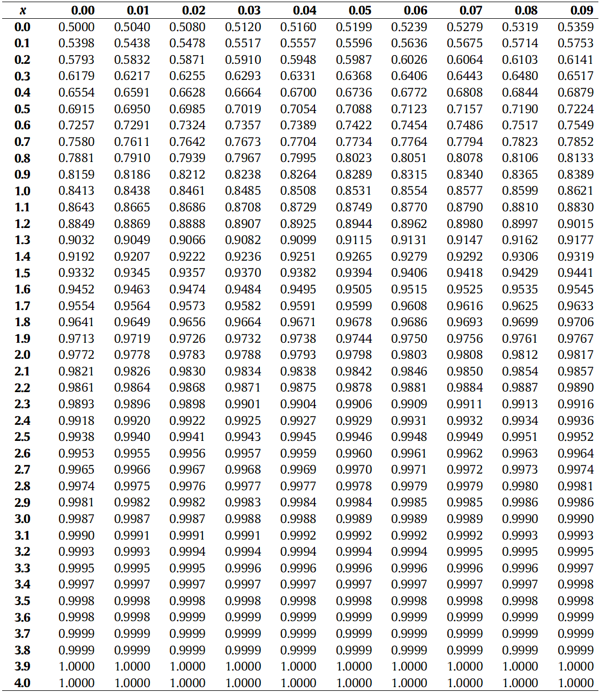
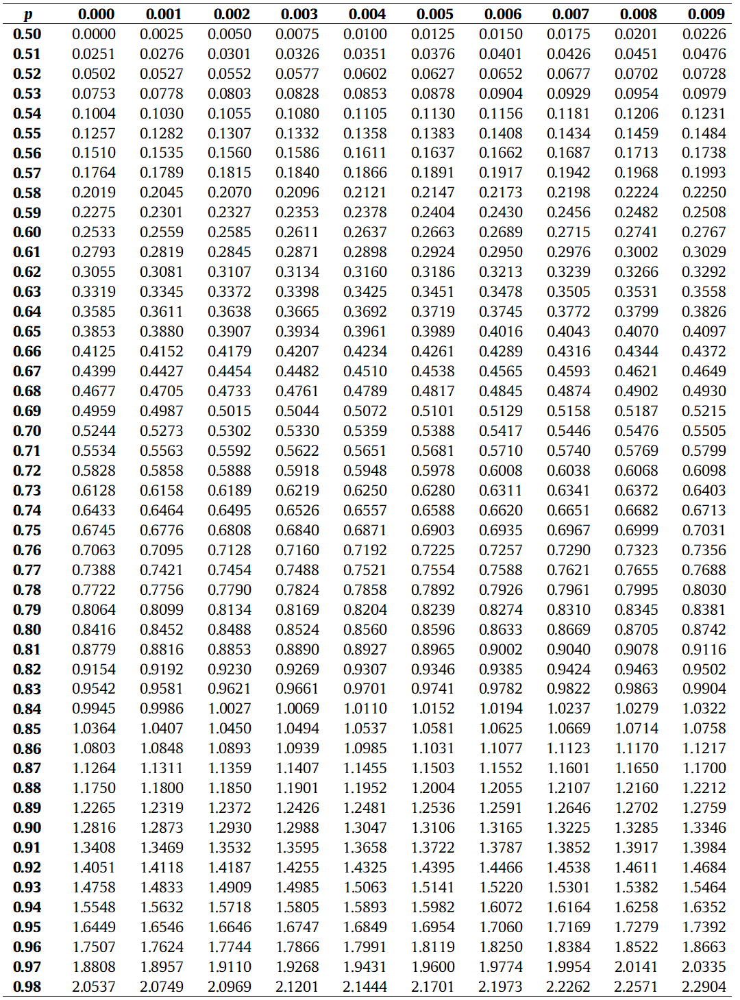
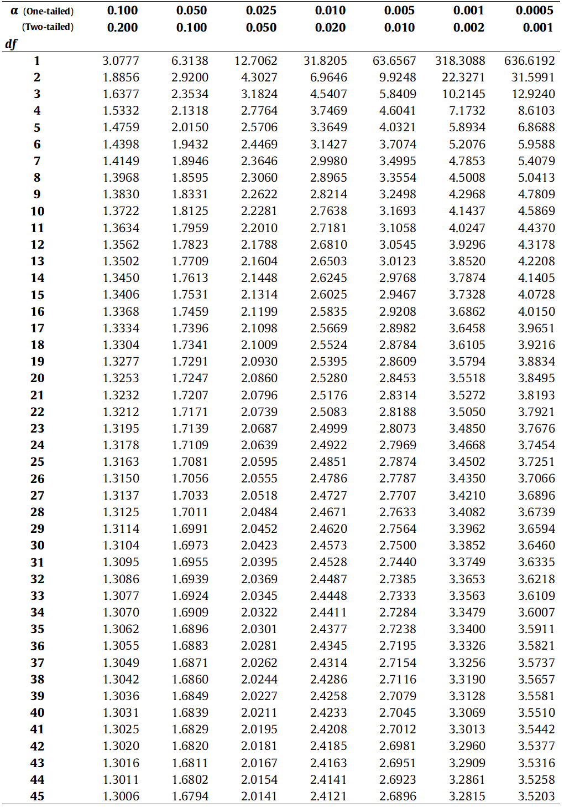
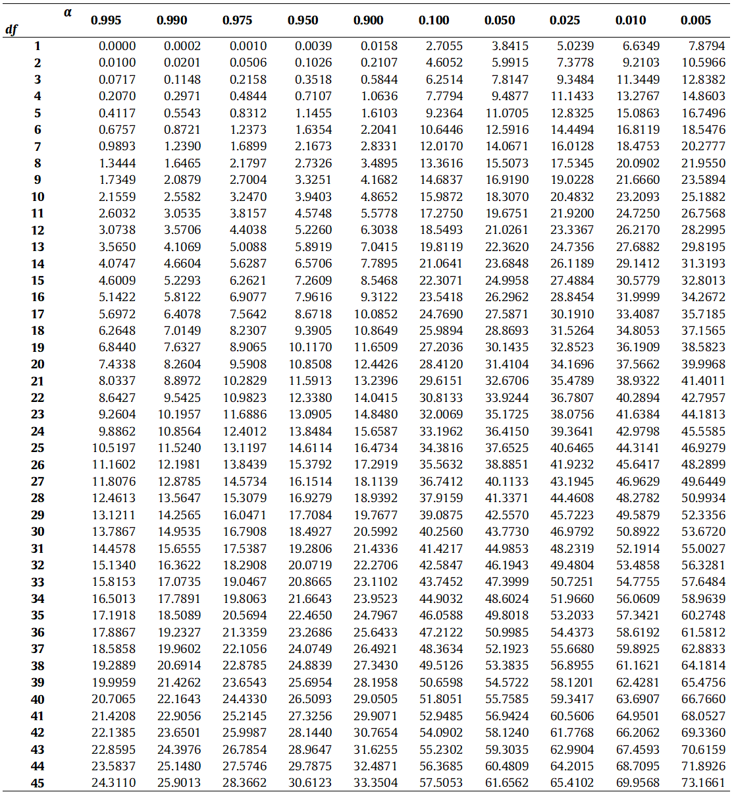
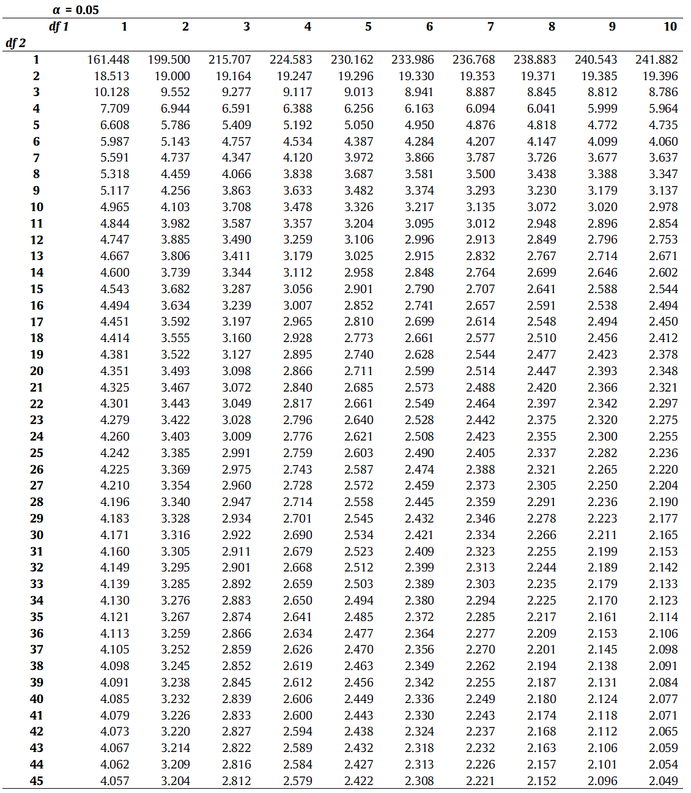
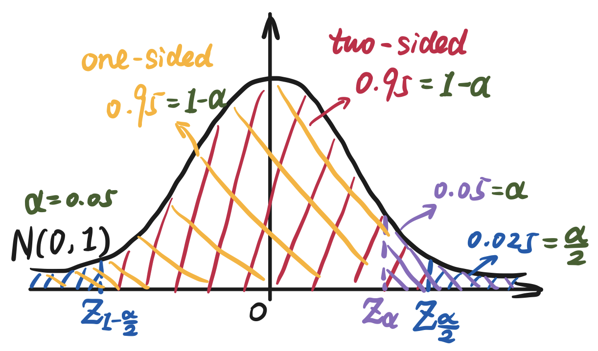

## 2. Parameters Estimation · 参数估计

1. **Parameters Estimation**

   The known population fit to a certain distribution, we ==estimate the unknown parameters of this population by the sample data==.

   There are 2 methods to estimate parameters: `Point Estimation` and `Interval Estimation`.

   | Estimation Type         | Advantages                                                   | Disadvantages                                              |
   | ----------------------- | ------------------------------------------------------------ | ---------------------------------------------------------- |
   | **Point Estimation**    | Can get a precise value                                      | Cannot determine the credibility                           |
   | **Interval Estimation** | Can get the credibility of all interval (*i.e.*, `Confidence Level` $1-\alpha$) | Only can obtain the upper and lower bounds of the interval |

2. **Goodness Criterion (优良性准则)**

   **(1) Unbiased Estimation · 无偏性**
   The parameters estimated by the samples is equal to the real population parameters, $E(\hat{\theta})=\theta$

   **(2) Validity · 有效性**
   The parameters centered around the true value of the parameters to be estimated, *i.e.*, The variance between the parameters to be estimated and the real parameters.

   **(3) Consistency · 一致性**
   When the number of the samples approaches $+\infin$, the estimated value is close to the true value.

### 2.1. Point Estimation · 点估计

Let the population $X$ is determined by limited number of parameters $F_\theta = (\theta_1, \theta_2, \cdots, \theta_m)^T$, then all its probably values consist the `Parameter Space` $\Theta$ of $X$. Denote $f(x;\theta)$ as the distribution law of $X$.

Let the sample $\{X_1, X_2, \cdots, X_n\}$ be independent and identically distributed (as $f(x;\theta)$), to estimate the population parameter $\theta$, we need to ==construct $\hat{\theta}=\hat{\theta}\{X\}=\hat{\theta}(X_1,X_2,\cdots,X_n)$ which is determined only by samples $\{X_1, X_2, \cdots, X_n\}$ as the estimation of $\theta$==.

There 3 ways to make point estimation: `Moment Estimation`, `Maximum Likelihood Estimation`, `Oridinary Least Squares` (OLS).

#### 2.1.1. **Maximum Likelihood Estimation · 极大似然法**

For the `Likelihood Function` $\mathcal{L}(x;\theta) = \mathcal{L}(\theta; x_1, x_2, \cdots, x_n)=\prod_{i=1}^n{f(x_i;\theta)}$, if $\hat{\theta}(X_1,X_2,\cdots,X_n)$ satisfied $\mathcal{L}(\hat{\theta};X) = \sup\limits_{\theta \in \Theta}\mathcal{L}(\theta;X)$ (*p.s.*, supremum = local maximum 上确界, infimum = local minimum 下确界), then $\hat{\theta}$ is the `Maximum Likelihood Estimation` of $\theta$.
$$
\left \{
\begin{aligned}
	&\frac{\part\mathcal{L}(\theta;X)}{\part\theta_i} = 0 &, i=1,2,\cdots,n \quad\quad&\text{Likelihood Function} \\
	&\frac{\part \ln\mathcal{L}(\theta;X)}{\part\theta_i} = 0 &, i=1,2,\cdots,n \quad\quad&\text{Log-Likelihood Function} 
\end{aligned}
\right.
\tag{2.1}\label{2.1}
$$
where, because the accumulate multiplication of $\mathcal{L}(X;\theta) = \prod_{i=1}^n{f(X_i;\theta)}$ will get a too tremendous value (The lager $X$, the more complex of the $\prod$, and its result will far greater than $\sum$, etc.), so we take the log to make it smaller (Log can turn the $\times$ to $+$).

#### 2.1.2. Analytical Solution in Continuous Function Space · 连续函数空间的解析解

Take the normal distribution as an example.
$$
\begin{aligned}
& \mathcal{L}(\mu,\sigma^2;x) = \prod_{i=1}^n{f(x_i;\mu,\sigma^2)} = \left(2\pi\sigma^2\right)^{-\frac{n}2} e^{-\frac{1}{2\sigma^2}\sum\limits_{i=1}^{n}{(x_i-\mu)^2}} \\

\Rightarrow & \ln\mathcal{L}(\mu,\sigma^2;x) = -\frac{n}2\ln\left(2\pi\sigma^2\right) - \frac{1}{2\sigma^2}\sum_{i=1}^{n}{(x_i-\mu)^2} \\

\Rightarrow &\left \{
    \begin{aligned}
    &\frac{\part \ln\mathcal{L}(\mu,\sigma^2;x)}{\color{Orchid}{\part\mu}} = \frac{1}{\sigma^2}\sum_{i=1}^{n}{(x_i-\mu)} = 0 \\
    &\frac{\part \ln\mathcal{L}(\mu,\sigma^2;x)}{\color{Orchid}{\part\sigma^2}} = -\frac{n}{2\sigma^2} + \frac{1}{2\sigma^4}\sum_{i=1}^{n}{(x_i-\mu)^2} = 0
    \end{aligned}
\right. \\\\

\Rightarrow &\left \{
    \begin{aligned}
    &\mu =  \frac{1}{n}\sum_{i=1}^{n}{x_i} = \bar{x} \\
    &\sigma^2 = \frac{1}{n}\sum_{i=1}^{n}{(x_i-\bar{x})^2}
    \end{aligned},\quad\quad
    \text{same as the population mean and variance}
\right.

\end{aligned}
$$

```python
""" 通过极大似然法估计总体的参数, 以正态分布为例。
(1) 生成1000个均值为 2,标准差为 10 的正态分布随机变量。
(2) 通过上述公式估计均值和标准差，比较二者之间的异同
(3) 很显然存在误差，而且在随机变量的样本量不断增加时，估计值不断逼近总体的参数值。
"""

import numpy as np
import scipy.stats as st

# 均值为 2，标准差为 10 的正态分布随机变量 1000 个
x = st.norm.rvs(loc=2, scale=10, size=1000)

# 通过上述对数似然方程的估计公式，计算均值和标准差
mu = np.sum(x) / len(x)
sigma = np.sqrt(np.sum((x - np.mean(x)) ** 2) / len(x))
```

#### 2.1.3. Numerical Solution of Logarithm Likelihood Function · 对数似然方程的数值解

`Numerical Solution` means the solution is not the exact solution but a approximate solution, mostly obtained by iterating.

Take the `Cauchy Distribution` as an example. Cauchy distribution is a symmetric distribution like normal distribution. Standard Cauchy Distribution: $\cases{\gamma=1\\\theta=0}$.

| Parameter                    | Meaning                                                      |
| :--------------------------- | ------------------------------------------------------------ |
| Scale Parameter: $\gamma$    | The dispersion of the distribution of population (Unlike `variance`, because it is divergent) |
| Location Parameter: $\theta$ | The central tendency of the distribution of population (Like `Mean` $\mu$) |

$$
\begin{aligned}
& f(x;\theta,\gamma) = \frac{1}{\pi}\left[\frac{\gamma}{\gamma^2+(x-\theta)^2}\right] \\

\stackrel{\gamma=1}{\longrightarrow} & f(x;\theta) = \frac{1}{\pi\left[1+(x-\theta)^2\right]} \\

\Rightarrow & \mathcal{L}(\theta;x) = \prod_{i=1}^n{f(x_i;\theta)} = \frac{1}{\pi^n}\prod_{i=1}^{n}{\frac{1}{1+(x_i-\theta)^2}} \\

\Rightarrow & \ln\mathcal{L}(\theta;x) = -n\ln(\pi) - \sum_{i=1}^{n}\ln\left[1+(x_i-\theta)^2\right] \\

\Rightarrow & \frac{\part\ln\mathcal{L}(\theta;x)}{\part\theta} = \sum_{i=1}^{n}{\frac{x_i-\theta}{1+(x_i-\theta)}} = 0 \\\\

\Rightarrow & \text{Iterating solve $x$ using Newton's Method}

\end{aligned}
$$


==`Newton's Method`: an iterative solution. For solving $f(x)=0$:==
(1) Randomly guess an initial value $x_0$ approximate the true solution;
(2) Use $x_{n+1} = x_n - \frac{f(x_n)}{f'(x_n)}$ to iteratively solve;
(3) Stop condition: Usually stop when $\lvert x_{n+1} - x_n \rvert < \text{some small constant(like $1e-18 = 10^{-18}$)}$. Now **the converged value is the *local extremum*** but not the *global extremum*. (*p.s.*, The premise of the existence of the local extremum of $f(x)$ is $f''(x)<0$)

**Principle**: Let $x_k$ be the approximate root of $f(x)=0$. When $f(x)$ is near $x_k$, the value of $f(x)$ can be approximated by `The First Order Taylor Polynomial`
$$
p(x)=f(x_k)+f'(x_k)(x-x_k) \cong f(x) = 0 \quad\Longleftrightarrow\quad x_{n+1} = x_n - \frac{f(x_n)}{f'(x_n)}
$$

```python
""" 使用 Scipy 的 fsolve() 和 root() 函数求似然方程的数值解。
fsolve() 和 root() 函数都需要使用样本数据的中位数作为求解的起始点。
"""

from scipy.optimize import fsolve,root

# 生成模拟数据
data = st.cauchy.rvs(loc=15, scale=1, size=100)

# 对数似然方程
def func(theta, x):  # 求解的参数值放在前面，需带入的数据放在后面
    return np.sum((x - theta) / (1 + (x - theta) ** 2))
#        fsolve(<待求解方程>, <求解起始点>, <需带入数据>)
result_1 = fsolve(func, np.median(data), args=data)
print('fsolve函数求解：',result_1)
# root 比 fsolve 好一点
result_2 = root(func, np.median(data), args=data)
print('root函数求解', result_2.x)  # 返回值是一个对象，对象的 x 属性就是求解的值

print('模拟数据的中位数：', np.median(data))
```

```python
# 牛顿法
def cauchy_mle(x, theta):  # 其实和上面的 func() 
    sum = 0
    for i in range(0, len(x)):
        sum += (x[i] - theta) / (1 + (x[i] - theta) ** 2)
    return sum

# 对数似然函数的一阶导数
def cauchy_mle_d(x, theta):
    sum = 0  
    for i in range(0, len(x)):
        tmp = (x[i] - theta) ** 2
        sum += (tmp - 1) / (1 + tmp) ** 2
    return sum

# 用样本中位数作为初始估计值
theta = np.median(data)

# 迭代次数控制, 当前一次迭代值与当前迭代值小于0.001时停止迭代, 说明已经收敛。
std_diff = 1e-18

while True:  # 无限循环
    # 牛顿法的迭代公式
    theta1 = theta - cauchy_mle(data, theta) / cauchy_mle_d(data, theta)
    # 当本次迭代的数值解和上次迭代数值解之差的绝对值小于阈值时，停止迭代
    if np.abs(theta1 - theta) <= std_diff:
        break
    else:
        theta = theta1
    print(theta)  # 每次循环都打印一次
```

### 2.2. Interval Estimation · 区间估计

Let the population $X \sim F(x;\theta)$, for the given value $\alpha\in(0,1)$, if
$$
P\left\{\hat{\theta}_1(X_1,X_2,\cdots,X_n) < \theta < \hat{\theta}_2(X_1,X_2,\cdots,X_n) \right\} = 1-\alpha
$$
then $(\hat{\theta}_1,\hat{\theta}_2)$ is the `Confidence Interval` with `Confidence Level` $=1-\alpha$ (usually = 0.95) ($\alpha$ is the `Significance Level` which usually = 0.05) of $\theta$. Confidence level $1-\alpha$ means ***the proportion** of the area that satisfied a certain condition (like $P\{X<x\}$) to the total area under the specific distribution* (指定分布下满足某条件的区域的面积占总面积的比例).

#### 2.2.1. Interval Estimation of $\mu$ of Single Normal Population · 单个正态总体的均值 $\mu$ 的区间估计

Let $X \sim \mathcal{N}\left(\mu,\sigma^2\right)$, the sample $\{X_1,X_2,\cdots,X_n\}$ is from $X$, $\left(\bar{X},S^2\right)$ is the sample mean and variance.

1. **$\sigma^2$ is known**:

   Z-transform can normalize $\mathcal{N}\left(\mu,\sigma^2\right)$ to $\mathcal{N}(0,1)$.
   $$
   \begin{aligned}
   & Z=\frac{\bar{X}-\mu}{\frac{\sigma}{\sqrt{n}}} \sim \mathcal{N}(0,1) \\\\
   
   \Rightarrow &  P\left\{\left\vert\frac{\bar{X}-\mu}{\frac{\sigma}{\sqrt{n}}}\right\vert \leqslant Z_{\frac{\alpha}2}\right\} = P\left\{Z_{1-\frac{\alpha}2} \leqslant \frac{\bar{X}-\mu}{\frac{\sigma}{\sqrt{n}}} \leqslant Z_{\frac{\alpha}2}\right\} = 1-\alpha \\\\
   
   & p.s. Z_{1-\frac{\alpha}2} = -Z_{\frac{\alpha}2}
   
   \end{aligned}
   \tag{2.2}\label{2.2}
   $$
   where the $Z_{\frac{\alpha}2}$ is the *$\alpha$-upper-quantile* of $\mathcal{N}(0,1)$, that is, the $Z$-value when the area on the right side of $\mathcal{N}(0,1)$ is $\frac{\alpha}2$ (i.e., $\Phi(Z_{\frac{\alpha}2}) = P\{X \leqslant Z_{\frac{\alpha}2}\} = \int_{-\infin}^{Z_{\frac{\alpha}2}} \phi(t) \, {\rm d}t = 1-\frac{\alpha}2$, where $\Phi(·)$ is the *Standard Normal Distribution Function*).

   > *p.s.*, *upper quantile* (aka *right-tailed probability*) means the right sector of the distribution at $x_0$.
   >
   > The table of the standard normal distribution and the table of quantile of the standard normal distribution is *left-tailed*, ==so $Z_{\frac{\alpha}{2},\text{right-tailed}} = Z_{1-\frac{\alpha}{2}, \text{left-tailed}}$.==
   >
   > <center><p> The table of the standard normal distribution </p></center>
   >
   > 
   >
   > <center><p> The table of quantile of the standard normal distribution </p></center>
   >
   > 

   So the two-sided confidence interval about the mean $\mu$ and the confidence level $1-\alpha$ is 
   $$
   \mu \in \left[\bar{X} - \frac{\sigma}{\sqrt{n}} Z_{\frac{\alpha}2}, \bar{X} + \frac{\sigma}{\sqrt{n}} Z_{\frac{\alpha}2} \right]
   
   \tag{2.3}\label{2.3}
   $$

   the $\pm\frac{\sigma}{\sqrt{n}} Z_{\frac{\alpha}2}$ here is called `Estimation Error` (估计误差).

2. **$\sigma^2$ is unknown**:

   T-transform can let $\mathcal{N}\left(\mu,\sigma^2\right)$ fits $t(n-1)$.

   $$
   \begin{aligned}
   & T= \frac{\frac{\bar{X}-\mu}{\frac{\sigma}{\sqrt{n}}}}{\sqrt{\frac{\frac{(n-1)S^2}{\sigma^2}}{n-1}}} = \frac{\bar{X}-\mu}{\frac{S}{\sqrt{n}}} \sim t(n-1) \\\\
   
   \Rightarrow &  P\left\{\left\vert\frac{\bar{X}-\mu}{\frac{S}{\sqrt{n}}}\right\vert \leqslant t_{\frac{\alpha}2}(n-1)\right\} = P\left\{t_{1-\frac{\alpha}2} \leqslant \frac{\bar{X}-\mu}{\frac{S}{\sqrt{n}}} \leqslant t_{\frac{\alpha}2}\right\} = 1-\alpha \\\\
   
   & p.s. t_{1-\frac{\alpha}2} = -t_{\frac{\alpha}2}
   
   \end{aligned}
   \tag{2.4}\label{2.4}
   $$
   where $t_{\frac{\alpha}2}(n-1)$ (Can be abbreviated as $t_{\frac{\alpha}2}$) is the *$\alpha$-upper-quantile* of the t-distribution with $df=n-1$, that is, the $t$-value when the area on the right side of $t(n-1)$ is $\frac{\alpha}2$.
   
   > *p.s.*, The table of the t-distribution is *right-tailed*.
   >
   > <center><p> The table of the t-distribution </p></center>
   >
   > 
   
   So the two-sided confidence interval about the mean $\mu$ and the confidence level $1-\alpha$ is 
   $$
   \mu \in \left[\bar{X} - \frac{S}{\sqrt{n}} t_{\frac{\alpha}2}(n-1), \bar{X} + \frac{S}{\sqrt{n}} t_{\frac{\alpha}2} (n-1)\right]
   
   \tag{2.5}\label{2.5}
   $$
   
   the $\pm\frac{S}{\sqrt{n}} t_{\frac{\alpha}2}(n-1)$ is the estimation error.


> *e.g.*, The length of a certain machine parts fits $\mathcal{N}(\mu_{len}, \sigma^2_{len}=0.04)$; The weight of them fits $\mathcal{N}(\mu_{wei}, \sigma^2_{wei})$. Sampling the parts two times, we get 
> $$
> \begin{aligned}
> & \text{the length} = \{14.6, 15.1, 14.9, 14.8, 15.2, 15.1\}\ (mm) \\
> & \text{the weight} = \{10.1, 10, 9.8, 10.5, 9.7, 10.1, 9.9, 10.2, 10.3, 9.9\}\ (kg)
> \end{aligned}
> $$
> Find the interval estimation of $\mu_{len}$ and $\mu_{wei}$ with confidence level = 0.95 separately.
>
> **Solution.**
>
> We know $\sigma^2_{len}$ is known and $\sigma^2_{wei}$ is unknown, so we use $Z$-value to estimate $\mu_{len}$ and use $t$-value to estimate $\mu_{wei}$.
>
> 1. Length
> $$
> \begin{aligned}
>    & \left\{
>    \begin{aligned}
>    & \bar{X}_{len} = \frac{14.6+15.1+14.9+14.8+15.2+15.1}{6} = 14.95 \\
>    & \sigma^2_{len} = 0.04 \\
>    & Z_{\frac{\alpha}2} = Z_{0.025,\text{right-tailed}} = Z_{0.975,\text{left-tailed}} = 1.9600
>    \end{aligned}
>    \right.\\\\
>    
>    \Rightarrow & \frac{\sigma_{len}}{\sqrt{n}} Z_{\frac{\alpha}2} = \frac{0.2}{\sqrt{6}} \times 1.96 \approx 0.1600 \\\\
>             
>    \Rightarrow & \mu_{len} \in \left[\bar{X} - \frac{\sigma}{\sqrt{n}} Z_{\frac{\alpha}2}, \bar{X} + \frac{\sigma}{\sqrt{n}} Z_{\frac{\alpha}2} \right] = [14.8, 15.12]
>             
>    \end{aligned}
> $$
> 
> 2. Weight
> $$
>    \begin{aligned}
>    & \left\{
>    \begin{aligned}
>    & \bar{X}_{wei} = \frac{10.1+10+9.8+10.5+9.7+10.1+9.9+10.2+10.3+9.9}{10} = 10.05 \\
>    & S = \sqrt{\frac{1}{9}\sum_{i=1}^{10} \left(X_i - 10.05\right)^2} \approx 0.2415 \\
>    & t_{\frac{\alpha}2}(n-1) = t_{0.025}(10-1) = = t_{0.025,\text{right-tailed}}(9) = 2.2622
>    \end{aligned}
>    \right.\\\\
>    
>    \Rightarrow & \frac{S}{\sqrt{n}} t_{\frac{\alpha}2} = \frac{0.2415}{\sqrt{10}} \times 2.2622 \approx 0.1728 \\\\
>             
>    \Rightarrow & \mu_{wei} \in \left[\bar{X} - \frac{S}{\sqrt{n}} t_{\frac{\alpha}2}(n-1), \bar{X} + \frac{S}{\sqrt{n}} t_{\frac{\alpha}2} (n-1)\right] = [9.8722, 10.2228]
>             
>    \end{aligned}
> $$
> 
> ```python
>""" 单个正态总体的均值区间估计，分两种情况：方差已知；方差未知
> 可以大致了解数据的均值位于哪个区间，是否符合用户要求
> """
> from collections import namedtuple
> 
> # 命名元组：用来保存函数返回结果
> MuResultSet = namedtuple('MuResultSet', ['Mean', 'DF', 'Lower', 'Upper'])
> def interval_mu(x, sigma=-1, alpha=0.05):
>  n = len(x)  # 样本量
>  m = np.mean(x)  # 样本均值
> 
>  error = 0
>  # 根据方差已知与否计算上下限的加减量
>  if sigma >= 0:  # 总体方差已知 -> z
>      z = (sigma / np.sqrt(n)) * st.norm.ppf(1 - alpha / 2)
>      df = n
>      error = z
>  else:  # 总体方差未知 -> t
>      t = (st.tstd(x) / np.sqrt(n)) * st.t.ppf(1 - alpha / 2, n - 1)
>      df = n - 1
>      error = t
> 
>  lower = m - error  # 置信下限
>  upper = m + error  # 置信上限
> 
>  result = MuResultSet(
>      Mean=np.round(m, 2), 
>      DF=df,
>      Lower=np.round(lower, 6),
>      Upper=np.round(upper, 6)
>  )
> 
>  return result
> ```
> ```python
> lengths = np.array([14.6, 15.1, 14.9, 14.8, 15.2, 15.1])
> interval_mu(x=lengths, sigma=0.2)
> # MuResultSet(Mean=14.95, DF=6, Lower=14.78997, Upper=15.11003)
> 
> weights = np.array([10.1, 10, 9.8, 10.5, 9.7, 10.1, 9.9, 10.2, 10.3, 9.9])
> interval_mu(x=weights)
> # MuResultSet(Mean=10.05, DF=9, Lower=9.877225, Upper=10.222775)
> 
> 
> """ 使用 Scipy 中各分布相应的 interval() 计算置信区间
> 注意：interval() 的 scale 参数需要使用标准误（SD / √n），而非标准差
> """
> # 零件长度的置信区间，方差已知，使用正态分布的 interval 函数
> # 此处方差已知，所以直接使用 0.2, 即方差 0.04 的平方根
> # Scipy 库中所有区间估计都按照 ==左尾概率== 计算，直接写置信水平就行，不用一减或者除以二
> interval_1 = st.norm.interval(
>     0.95, 
>     loc=np.mean(lengths), 
>     scale=0.2 / np.sqrt(6)
> )
> # [14.78997 15.11003]
> print('通过Scipy的interval函数计算置信区间（方差已知）：', np.round(interval_1, 6))
> 
> 
> # 零件重量的置信区间，方差未知，使用 t 分布的 interval 函数
> # 此处第 4 个参数使用 ==样本的标准误==，可以调用 scipy 的 tsem 函数计算样本数据的标准误
> interval_2 = st.t.interval(
>     0.95, 
>     df=len(weights) - 1, 
>     loc=np.mean(weights),
>     scale=st.tsem(weights)
> )
> # [ 9.877225 10.222775]
> print('通过Scipy的interval函数计算置信区间（方差未知）：', np.round(interval_2, 6))
> ```

#### 2.2.2. Interval Estimation of $\sigma^2$ of Single Normal Population · 单个正态总体的方差 $\sigma^2$ 的区间估计

1. **$\mu$ is known**:
   $$
   \begin{aligned}
   & \text{MLE of $\sigma^2$ (see 2.1.2): } \hat{\sigma}^2 = \frac{1}{n} \sum_{i=1}^n (X_i-{\color{red}\mu})^2 \\
   
   \Rightarrow & \frac{n\hat{\sigma}^2}{\sigma^2} = \frac{\sum_{i=1}^n (X_i-{\color{red}\mu})^2}{\sigma^2} \sim \chi^2(n) \\\\
   
   \Rightarrow & P\left\{ \chi^2_{1-\frac{\alpha}2}(n) \leqslant \frac{n\hat{\sigma}^2}{\sigma^2} \leqslant \chi^2_{\frac{\alpha}2}(n) \right\} = 1-\alpha \\\\
   
   & p.s. \chi^2_{1-\frac{\alpha}2} = -\chi^2_{\frac{\alpha}2}
   
   \end{aligned}
   \tag{2.6}\label{2.6}
   $$
   So the two-sided confidence interval about the variance $\sigma^2$ and the confidence level $1-\alpha$ is 
   $$
   \sigma^2 \in \left[ \frac{n\hat{\sigma}^2}{\chi^2_{\frac{\alpha}{2}}(n)}, \frac{n\hat{\sigma}^2}{\chi^2_{1-\frac{\alpha}{2}}(n)}\right]
   
   \tag{2.7}\label{2.7}
   $$

2. **$\mu$ is unknown**:
   $$
   \begin{aligned}
   & S^2 = \frac{1}{n-1} \sum_{i=1}^n (X_i-{\color{red}\bar{X}})^2 \\
   
   \Rightarrow & \frac{(n-1)S^2}{\sigma^2} = \frac{\sum_{i=1}^n (X_i-{\color{red}\bar{X}})^2}{\sigma^2} \sim \chi^2(n-1) \\\\
   
   \Rightarrow & P\left\{ \chi^2_{1-\frac{\alpha}2}(n-1) \leqslant \frac{(n-1)S^2}{\sigma^2} \leqslant \chi^2_{\frac{\alpha}2}(n-1) \right\} = 1-\alpha \\\\
   
   & p.s. \chi^2_{1-\frac{\alpha}2} = -\chi^2_{\frac{\alpha}2}
   
   \end{aligned}
   \tag{2.8}\label{2.8}
   $$
   where $\frac{(n-1)S^2}{\sigma^2}$ fits $\chi^2(n-1)$ rather than $\chi^2(n)$, because in $S^2$, it minus $\bar{X}$ of sample, so the $df$ need to minus 1.
   
   So the two-sided confidence interval about the variance $\sigma^2$ and the confidence level $1-\alpha$ is 
   $$
   \sigma^2 \in \left[ \frac{(n-1)S^2}{\chi^2_{\frac{\alpha}{2}}(n-1)}, \frac{(n-1)S^2}{\chi^2_{1-\frac{\alpha}{2}}(n-1)}\right]
   
   \tag{2.9}\label{2.9}
   $$

> *p.s.*, The table of Chi-Squared distribution is *right-tailed*.
>
> <center><p> The table of the chi-squared distribution </p></center>
>
> 

> *e.g.*, Sample a certain machine part 10 times, and get its weight as follow:
> $$
> \text{the weight} = \{10.1, 10, 9.8, 10.5, 9.7, 10.1, 9.9, 10.2, 10.3, 9.9\}\ (kg)
> $$
> For the 2 situation (1) $\mu=10$; (2) $\mu$ is unknown, find $\sigma^2$ of the weight of the parts.
>
> **Solution.**
>
> We can solve this problem with the above formulas.
>
> ```python
> """ 单个正态总体的方差区间估计，分两种情况：均值已知和均值未知
> 可以用来测量数据的离散程度。
> """
> VarResultSet = namedtuple('VarResultSet', ['Var', 'DF', 'Lower', 'Upper'])
> def interval_var(x, mu=float('Inf'), alpha=0.05):
>  n = len(x)  # 样本量
> 
>  if mu < float('Inf'):  # 均值已知
>      S2 = np.sum((x - mu) ** 2) / n
>      df = n
>  else:  # 均值未知
>      S2 = st.tvar(x)  # 使用方差的无偏估计，与 np.var 区分开。
>      df = n - 1
> 
>  lower = df * S2 / st.chi2.ppf(1 - alpha / 2, df)
>  upper = df * S2 / st.chi2.ppf(alpha / 2, df)
> 
>  result = VarResultSet(
>      Var=S2,
>      DF=df,
>      Lower=np.round(lower, 6),
>      Upper=np.round(upper, 6)
>  )
> 
>  return result
> ```
>
> ```python
> weights = np.array([10.1, 10, 9.8, 10.5, 9.7, 10.1, 9.9, 10.2, 10.3, 9.9])
> # 已知均值为 10
> # VarResultSet(Var=0.05499999999999999, DF=10, Lower=0.026851, Upper=0.169389)
> print('已知均值为 10 的方差置信区间:', interval_var(weights, 10))
> 
> # 均值未知
> # VarResultSet(Var=0.05833333333333332, DF=9, Lower=0.027599, Upper=0.194416)
> print('未知均值的方差置信区间:', interval_var(weights))
> ```
>
> The result shows that ==*the confidence interval will be more narrow* (*i.e.*, The result is better) when $\mu$ is known.==

#### 2.2.3. Interval Estimation of $(\mu_1 - \mu_2)$ of Two Normal Population · 两个正态总体的均值之差 $(\mu_1 - \mu_2)$ 区间估计

In reality, we usually need to compare whether there is a difference in $\mu$s between 2 data. For example, we compare the effect of new method and the old method ($\mu_{\text{new method}} - \mu_{\text{old method}} $): 
	(1) If exists the obvious positive difference, then the new method is more effective; 
	(2) If exists the obvious negative difference, then the old method is more effective; 
	(3) If does not exist the obvious difference, then the 2 methods have no significant difference in effect. 

1. **$\sigma_1^2, \sigma_2^2$ is known**: 
   $$
   \begin{aligned}
   &(\bar{X}-\bar{Y}) \sim \mathcal{N}\left( \mu_1-\mu_2, \frac{\sigma_1^2}{n_1}+\frac{\sigma_2^2}{n_2} \right) \\
   
   \Rightarrow & Z=\frac{(\bar{X}-\bar{Y})-(\mu_1-\mu_2)}{\sqrt{\frac{\sigma_1^2}{n_1}+\frac{\sigma_2^2}{n_2}}} \sim \mathcal{N}(0,1)
   
   \end{aligned}
   \tag{2.10}\label{2.10}
   $$
   So the two-sided confidence interval about $(\mu_1 - \mu_2)$ and the confidence level $1-\alpha$ is 
   $$
   (\mu_1 - \mu_2) \in \left[ (\bar{X}-\bar{Y}) - \sqrt{\frac{\sigma_1^2}{n_1}+\frac{\sigma_2^2}{n_2}} Z_{\frac{\alpha}2}, (\bar{X}-\bar{Y}) + \sqrt{\frac{\sigma_1^2}{n_1}+\frac{\sigma_2^2}{n_2}} Z_{\frac{\alpha}2} \right]
   \tag{2.11}\label{2.11}
   $$
   
2. **$\sigma_1^2, \sigma_2^2$ is unknown**: 
   1. **$\sigma_1^2 = \sigma_2^2 = \sigma^2$**
      $$
      \begin{aligned}
      & T = \frac{(\bar{X}-\bar{Y}) - (\mu_1-\mu_2)}{S_\omega \sqrt{\frac{1}{n_1} + \frac{1}{n_2}}} \sim t_{\frac{\alpha}{2}}(n_1 + n_2 - 2) \\
      
      \text{where } & S_\omega = \sqrt{\frac{(n_1-1)S_1^2 + (n_2-1)S_2^2}{n_1+n_2-2}} \text{ is the combined estimator of }\sigma^2
      
      \end{aligned}
      \tag{2.12}\label{2.12}
      $$
      So the two-sided confidence interval about $(\mu_1 - \mu_2)$ and the confidence level $1-\alpha$ is 
      $$
      \begin{aligned}
      (\mu_1 - \mu_2) \in & \left[ (\bar{X}-\bar{Y}) - S_\omega \sqrt{\frac{1}{n_1} + \frac{1}{n_2}}t_{\frac{\alpha}{2}}(n_1 + n_2 - 2) \right., \\
      
      &\ \  \left. (\bar{X}-\bar{Y}) + S_\omega \sqrt{\frac{1}{n_1} + \frac{1}{n_2}}t_{\frac{\alpha}{2}}(n_1 + n_2 - 2) \right]
      \end{aligned}
      \tag{2.13}\label{2.13}
      $$

   2. **$\sigma_1^2 \ne \sigma_2^2$**
      $$
      \begin{aligned}
      & T = \frac{(\bar{X}-\bar{Y}) - (\mu_1-\mu_2)}{\sqrt{\frac{S_1^2}{n_1} + \frac{S_2^2}{n_2}}} \sim t_{\frac{\alpha}{2}}(\nu) \\\\
      
      \text{where } &
      	\left\{\begin{aligned}
      		& \nu = \frac{\left( \frac{\sigma_1^2}{n_1} + \frac{\sigma_2^2}{n_2} \right)^2}{\frac{\left( \frac{\sigma_1^2}{n_1} \right)^2}{n_1-1} + \frac{\left( \frac{\sigma_2^2}{n_1} \right)^2}{n_2-1}} \\\\
      		& \hat{\nu} = \frac{\left( \frac{S_1^2}{n_2} + \frac{S_2^2}{n_2} \right)^2}{\frac{\left( \frac{S_1^2}{n_1} \right)^2}{n_1-1} + \frac{\left( \frac{S_2^2}{n_1} \right)^2}{n_2-1}}
      	\end{aligned}\right.
      
      \end{aligned}
      \tag{2.14}\label{2.14}
      $$
      So the two-sided confidence interval about $(\mu_1 - \mu_2)$ and the confidence level $1-\alpha$ is 
      $$
      (\mu_1 - \mu_2) \in \left[ (\bar{X}-\bar{Y}) - \sqrt{\frac{S_1^2}{n_1} + \frac{S_2^2}{n_2}}t_{\frac{\alpha}{2}}(\hat{\nu}), (\bar{X}-\bar{Y}) + \sqrt{\frac{S_1^2}{n_1} + \frac{S_2^2}{n_2}}t_{\frac{\alpha}{2}}(\hat{\nu}) \right]
      \tag{2.15}\label{2.15}
      $$
      

> *e.g.1*, There are strength data of 2 kinds of cottons: $X \sim \mathcal{N}\left( \mu_1, 2.18^2 \right), Y \sim \mathcal{N}\left( \mu_2, 1.76^2 \right)$. Take 100 samples from $X$ and $Y$ respectively (Their data yield by computer, $\mu_1 = 5.32,\mu_2 = 5.76$), find the interval estimation of $(\mu_1-\mu_2)$ with confidence level = 0.95.
>
> **Solution.**
>
> ```python
> def interval_mu2(x, y, sigma=np.array([-1, -1]), equal_var=False, alpha=0.05):
>     n1 = len(x)
>     n2 = len(y)
>     mx = np.mean(x)
>     my = np.mean(y)
>     
>     error = 0
>     if np.all(sigma>0):  # 两个独立样本的方差已知
>         # 根据上述公式计算置信区间上、下限的加、减量
>         error = st.norm.ppf(1 - alpha / 2) * np.sqrt(sigma[0] ** 2 / n1 + sigma[1] ** 2 / n2)
>         df = n1 + n2
>     else:
>         if equal_var:  # 两个独立样本的方差相等且未知
>             sw = ((n1 - 1) * st.tvar(x) + (n2 - 1) * st.tvar(y)) / (n1 + n2 - 2)
>             error = np.sqrt(sw * (1 / n1 + 1 / n2)) * st.t.ppf(1 - alpha / 2, n1 + n2 - 2)
>             df = n1 + n2 - 2
>         else:  # 两个独立样本的方差不相等且未知
>             s1 = st.tvar(x)
>             s2 = st.tvar(y)
>             nu = ((s1 / n1 + s2 / n2) ** 2) / (s1 ** 2 / (n1 ** 2 * (n1 - 1)) + s2 ** 2/(n2 ** 2 * (n2 - 1)))
>             error = st.t.ppf(1 - alpha / 2, nu) * np.sqrt(s1 / n1 + s2 / n2)
>             df = nu
>             
>     result = MuResultSet(
>         Mean=mx-my,
>         DF=df, 
>         Lower=np.round(mx-my-error, 6), 
>         Upper=np.round(mx-my+error, 6)
>     )
>     
>     return result
> ```
>
> ```python
> # 根据均值和标准差生成两个独立样本数据
> x = st.norm.rvs(loc=5.32, scale=2.18, size=100)
> y = st.norm.rvs(loc=5.76, scale=1.76, size=100)
> 
> # 调用区间估计函数，方差已知
> result = interval_mu2(x, y, np.array([2.18, 3.76])) 
> # 上下区间分别大于0，小于0：不能拒绝 mu1 = mu2, 说明两个独立样本可能具有相同均值
> # MuResultSet(Mean=-0.5701989757282524, DF=200, Lower=-1.422051, Upper=0.281653)
> print("mu1-mu2置信水平0.95的区间估计为：", result)
> 
> # 调用 t 检验函数，原假设是两个独立样本具有相同均值
> result1 = st.ttest_ind(x, y, equal_var=False)
> # p < 0.05, 拒绝原假设，说明两个独立样本不具有相同均值
> # TtestResult(statistic=-2.037310560867354, pvalue=0.042977193227754985, df=193.98241112873927)
> print("调用Scipy的t检验函数：", result1)
> ```

> *e.g.2*, A company use 2 automated assembly lines to fill the mineral water. Take 12, 17 samples from the different assembly line respectively and measure their volume (ml). Assume that $X \sim \mathcal{N}\left( \mu_1, \sigma_1^2 \right), Y \sim \mathcal{N}\left( \mu_2, \sigma_2^2 \right)$, find the interval estimation of $(\mu_1-\mu_2)$ with confidence level = 0.95. (Their data yield by computer, $\mu_1 = 501.1,\mu_2 = 499.7; \sigma_1 = 2.4, \sigma_2 = 4.7.$)
>
> **Solution.**
>
> ```python
> # e.g.2
> x = st.norm.rvs(501.1, 2.4, 12)
> y = st.norm.rvs(499.7, 4.7, 17)
> 
> # 方差未知，且相同
> result1 = interval_mu2(x, y, equal_var=True)
> # MuResultSet(Mean=0.14638971686571267, DF=27, Lower=-2.798738, Upper=3.091517)
> print("方差未知且相同：", result1)
> 
> # 方差未知，且不同
> result2 = interval_mu2(x, y)
> # MuResultSet(Mean=0.14638971686571267, DF=26.13378896077253, Lower=-2.548855, Upper=2.841634)
> print("方差未知且不同:", result2)
> 
> # 下面调用 Scipy 的 t 检验函数，分为方差相同和不同
> result3 = st.ttest_ind(x, y, equal_var=True)
> # TtestResult(statistic=0.101987729807477, pvalue=0.9195200792503081, df=27.0)
> print("t检验，方差相同：", result3)
> 
> result4 = st.ttest_ind(x, y, equal_var=False)
> # TtestResult(statistic=0.11161636886610386, pvalue=0.9119804563419185, df=26.13378896077253)
> print("t检验，方差不同：", result4)
> ```

#### 2.2.4. Interval Estimation of $\frac{\sigma_1^2}{\sigma_2^2}$ of Two Normal Population · 两个正态总体的方差之比 $\frac{\sigma_1^2}{\sigma_2^2}$ 区间估计

1. **$\mu_1, \mu_2$ is known**:
   $$
   \begin{aligned}
   &\left\{\begin{aligned}
   	& \hat{\sigma}_1^2 = \frac{1}{n_1}\sum_{i=1}^n (X_i-\mu_1)^2 \\
       & \hat{\sigma}_2^2 = \frac{1}{n_2}\sum_{i=1}^n (X_i-\mu_2)^2
   \end{aligned}\right. \\
   
   \Rightarrow & F=\frac{\frac{\hat{\sigma}_1^2}{\sigma_1^2}}{\frac{\hat{\sigma}_2^2}{\sigma_2^2}} \sim F(n_1,n_2)
   \end{aligned}
   \tag{2.16}\label{2.16}
   $$
   So the two-sided confidence interval about $\frac{\sigma_1^2}{\sigma_2^2}$ and the confidence level $1-\alpha$ is 
   $$
   \frac{\sigma_1^2}{\sigma_2^2} \in \left[ \frac{\frac{\hat{\sigma}_1^2}{{\hat\sigma}_2^2}}{F_{\frac{\alpha}{2}}(n_1,n_2)}, \frac{\frac{\hat{\sigma}_1^2}{{\hat\sigma}_2^2}}{F_{1-\frac{\alpha}{2}}(n_1,n_2)}\right]
   \tag{2.17}\label{2.17}
   $$

2. **$\mu_1, \mu_2$ is unknown**:
   $$
   \begin{aligned}
   &\left\{\begin{aligned}
   	& S_1^2 = \frac{1}{n_1-1}\sum_{i=1}^n (X_i-\mu_1)^2 \\
       & S_2^2 = \frac{1}{n_2-1}\sum_{i=1}^n (X_i-\mu_2)^2
   \end{aligned}\right. \\
   
   \Rightarrow & F=\frac{\frac{S_1^2}{\sigma_1^2}}{\frac{S_2^2}{\sigma_2^2}} \sim F(n_1-1,n_2-1)
   \end{aligned}
   \tag{2.18}\label{2.18}
   $$
   So the two-sided confidence interval about $\frac{\sigma_1^2}{\sigma_2^2}$ and the confidence level $1-\alpha$ is 
   $$
   \frac{\sigma_1^2}{\sigma_2^2} \in \left[ \frac{\frac{S_1^2}{S_2^2}}{F_{\frac{\alpha}{2}}(n_1-1,n_2-1)}, \frac{\frac{S_1^2}{S_2^2}}{F_{1-\frac{\alpha}{2}}(n_1-1,n_2-1)}\right]
   \tag{2.19}\label{2.19}
   $$

> *p.s.*, The table of F-distribution is *right-tailed*.
>
> <center><p> The table of the F-distribution </p></center>
>
> 

> *e.g.*, There are 2 group of data:
> $$
> \begin{aligned}
> & X = \{79.98, 80.04, 80.02, 80.04, 80.03, 80.03, 80.04, 
>               79.97, 80.05, 80.03, 80.02, 80.00, 80.02\} \\
> & Y = \{80.02, 79.94, 79.98, 79.97, 79.97, 80.03, 79.95, 79.97\}
> \end{aligned}
> $$
> For these 2 situation: (1) $\mu_1=\mu_2=80$; (2) $\mu$ is unknown, find the interval estimation of $\frac{\sigma_1^2}{\sigma_2^2}$ with confidence level = 0.95.
>
> **Solution.**
>
> ```python
> VRateResultSet = namedtuple("VRateResultSet", ["Rate", "DF1", "DF2", "Lower", "Upper"])
> def interval_var2(x, y, mu=np.array([float("Inf"), float("Inf")]), alpha=0.05):
>     n1 = len(x)  # 样本量
>     n2 = len(y)
>     
>     if np.all(mu < float("Inf")):  # 均值已知
>         # 根据已知均值计算方差
>         Sx2 = 1 / n1 * np.sum((x - mu[0]) ** 2)
>         Sy2 = 1 / n2 * np.sum((y - mu[1]) ** 2)
>         df1 = n1
>         df2 = n2        
>     else:  # 均值未知
>         # 直接计算样本方差作为总体方差的无偏估计，此时自由度等于：样本量 - 1
>         Sx2 = st.tvar(x)
>         Sy2 = st.tvar(y)
>         df1 = n1 - 1
>         df2 = n2 - 1
>         
>     rate = Sx2 / Sy2
>     lower = rate / st.f.ppf(1 - alpha / 2, df1, df2)
>     upper = rate / st.f.ppf(alpha / 2, df1, df2)
>     
>     result = VRateResultSet(
>         Rate=rate, 
>         DF1=df1, 
>         DF2=df2, 
>         Lower=np.round(lower, 6), 
>         Upper=np.round(upper, 6)
>     )
>     
>     return result
> ```
>
> ```python
> x = np.array([79.98, 80.04, 80.02, 80.04, 80.03, 80.03, 80.04, 
>               79.97, 80.05, 80.03, 80.02, 80.00, 80.02])
> y = np.array([80.02, 79.94, 79.98, 79.97, 79.97, 80.03, 79.95, 79.97])
> 
> # 均值已知
> result1 = interval_var2(x, y, np.array([80, 80]))
> # VRateResultSet(Rate=0.7326007326007866, DF1=13, DF2=8, Lower=0.176014, Upper=2.482042)
> print("均值已知的方差比：", result1)
> 
> # 均值未知
> result2 = interval_var2(x, y)
> # VRateResultSet(Rate=0.5837405184048123, DF1=12, DF2=7, Lower=0.12511, Upper=2.105269)
> print("均值未知的方差比：", result2)
> ```

#### 2.2.5. Interval Estimation of $\mu$ of Non-Normal Population · 非正态总体的均值 $\mu$ 区间估计

`Central Limit Theorem`: Let $\{X_1, X_2, \cdots, X_n\}$ is independent and identically distributed, then its distribution function
$$
\lim_{n \to \infin} F_n\{x\} = \lim_{n \to \infin} P\left\{ \frac{\sum_{i=1}^n X_i-n\mu}{\sqrt{n} \sigma} = \frac{\bar{X}-\mu}{\frac{\sigma}{\sqrt{n}}} \leqslant x \right\} = \frac{1}{\sqrt{2\pi}} \int_{-\infin}^{x} e^{-\frac{t^2}{2}}\, {\rm d}t = \varnothing(x)?
$$
That is means, ==when $n$ is big enough (usually $n\geqslant30$), then its $Z=\frac{\bar{X}-\mu}{\frac{\sigma}{\sqrt{n}}} \sim \mathcal{N}(0,1)$.==

1. **$\sigma^2$ is known**:

   The two-sided confidence interval about the mean $\mu$ and the confidence level $1-\alpha$ is 
   $$
   \mu \in \left[\bar{X} - \frac{\sigma}{\sqrt{n}} Z_{\frac{\alpha}2}, \bar{X} + \frac{\sigma}{\sqrt{n}} Z_{\frac{\alpha}2} \right]
   
   \tag{2.20}\label{2.20}
   $$

2. **$\sigma^2$ is unknown**:

   The two-sided confidence interval about the mean $\mu$ and the confidence level $1-\alpha$ is 
   $$
   \mu \in \left[\bar{X} - \frac{S}{\sqrt{n}} Z_{\frac{\alpha}2}, \bar{X} + \frac{S}{\sqrt{n}} Z_{\frac{\alpha}2} \right]
   
   \tag{2.21}\label{2.21}
   $$

> *e.g.*, Take 50 samples from batteries to test their lives (The data yield by computer, and fits the `Exponential Distribution` with the mean$= \frac{1}{\lambda} = 2.266$ (Unit: 100 hours)). 
> Find the confidence interval of the mean life of batteries with confidence level = 0.95.
>
> **Solution.**
>
> ```python
> NNResultSet = namedtuple("NNResultSet", ["Mean", "Lower", "Upper"])
> def interval_mu3(x, sigma=-1, alpha=0.05):
>     n = len(x)
>     mx = np.mean(x)
>     
>     error = 0
>     if sigma > 0:
>         error = sigma / np.sqrt(n) * st.norm.ppf(1 - alpha / 2)
>     else:
>         error = st.tstd(x) / np.sqrt(n) * st.norm.ppf(1 - alpha / 2)
>     return NNResultSet(
>         Mean=mx,
>         Lower=np.round(mx-error, 6),
>         Upper=np.round(mx+error, 6))
> ```
>
> ```python
> """ 示例：将符合指数分布的电池寿命数据转换成正态分布的均值区间估计
> 注意在生成指数分布的随机变量时, 一般使用 scale = 1 / lambda
> Scipy 的官方参考文档原文如此:
> This parameterization corresponds to using scale = 1 / lambda
> 本例中 1 / lambda = 2.266
> 注意当生成的随机数的数量越多时，置信区间的估计越精确
> """
> # 生成样本数据。样本量越大，区间估计越精确
> x = st.expon.rvs(scale=2.266, size=1000)
> 
> # 方差未知
> result1 = interval_mu3(x)
> print("方差未知的非正态总体均值区间估计：", result1)
> 
> # 调用 Scipy 的 interval 函数估计区间，方差未知。
> result2 = st.norm.interval(
>     0.95,
>     loc = np.mean(x),
>     scale=st.tstd(x) / (len(x) ** 0.5)
> )
> print("调用interval函数估计非正态总体均值置信区间：", np.round(result2, 6))
> ```

#### 2.2.6. One-Sided Confidence Interval Estimation · 单侧置信区间估计

Let the population $X \sim F(x;\theta)$, for the given value $\alpha\in(0,1)$, if
$$
\cases{
P\{\underline{\theta}(X_1,X_2,\cdots,X_n) \leqslant \theta \} = 1-\alpha \\\\
P\{\theta \leqslant \overline{\theta}(X_1,X_2,\cdots,X_n)\} = 1-\alpha}
$$
then $\underline{\theta}$ is the `Lower Confidence Limit` and $\overline{\theta}$ is the `Upper Confidence Limit` with `Confidence Level` $=1-\alpha$ (usually = 0.95) ($\alpha$ is the `Significance Level` which usually = 0.05) of $\theta$. ==$\underline{\theta}$ is the bigger the better; $\overline{\theta}$ is the smaller the better.==

Compared to two-sided estimation, one-sided estimation use different quantiles. Take $N(0,1)$ as an example.



For the same confidence level $=1-\alpha=95\%$:
	(1) The two-sided estimation divides the area $\alpha=0.05$ to two equal parts ($\frac{\alpha}{2}=0.025$), so we estimate the confidence limits by $Z_{\frac{\alpha}{2}}$; 
	(2) The one-sided estimation puts the area $\alpha=0.05$ in one side, so we estimate the confidence limits by $Z_{\alpha}$.

1. **Interval Estimation of $\mu$ of Single Normal Population**

   - **$\sigma^2$ is known**:
     $$
     \left \{
         \begin{aligned}
         & \underline{\mu} = \bar{X} - \frac{\sigma}{\sqrt{n}} Z_{\alpha}, &\mu \in \left[ \bar{X} - \frac{\sigma}{\sqrt{n}} Z_{\alpha}, +\infin \right) \\\\
         & \overline{\mu} = \bar{X} + \frac{\sigma}{\sqrt{n}} Z_{\alpha}, &\mu \in \left( -\infin, \bar{X} + \frac{\sigma}{\sqrt{n}} Z_{\alpha} \right]
         \end{aligned}
     \right.
     \tag{2.22}\label{2.22}
     $$

   - **$\sigma^2$ is unknown**:
     $$
     \left \{
         \begin{aligned}
         & \underline{\mu} = \bar{X} - \frac{S}{\sqrt{n}} t_{\alpha}(n-1), &\mu \in \left[ \bar{X} - \frac{S}{\sqrt{n}} t_{\alpha}(n-1), +\infin \right) \\\\
         & \overline{\mu} = \bar{X} + \frac{S}{\sqrt{n}} t_{\alpha}(n-1), &\mu \in \left( -\infin, \bar{X} + \frac{S}{\sqrt{n}} t_{\alpha}(n-1) \right]
         \end{aligned}
     \right.
     \tag{2.23}\label{2.23}
     $$

2. **Interval Estimation of $\sigma^2$ of Single Normal Population**

   - **$\mu$ is known**:
     $$
     \left \{
         \begin{aligned}
         & \underline{\sigma}^2 = \frac{n\hat{\sigma}^2}{\chi^2_{\alpha}(n)}, &\sigma^2 \in \left[ \frac{n\hat{\sigma}^2}{\chi^2_{\alpha}(n)}, +\infin \right) \\\\
         & \overline{\sigma}^2 = \frac{n\hat{\sigma}^2}{\chi^2_{1-\alpha}(n)}, &\sigma^2 \in \left[0?, \frac{n\hat{\sigma}^2}{\chi^2_{1-\alpha}(n)} \right]
         \end{aligned}
     \right.
     \tag{2.24}\label{2.24}
     $$

   - **$\mu$ is unknown**:
     $$
     \left \{
         \begin{aligned}
         & \underline{\sigma}^2 = \frac{(n-1)S^2}{\chi^2_{\alpha}(n-1)}, &\sigma^2 \in \left[ \frac{nS^2}{\chi^2_{\alpha}(n-1)}, +\infin \right) \\\\
         & \overline{\sigma}^2 = \frac{(n-1)S^2}{\chi^2_{1-\alpha}(n-1)}, &\sigma^2 \in \left[0?, \frac{nS^2}{\chi^2_{1-\alpha}(n-1)} \right]
         \end{aligned}
     \right.
     \tag{2.25}\label{2.25}
     $$

3. **Interval Estimation of $(\mu_1 - \mu_2)$ of Two Normal Population**

   - **$\sigma_1^2, \sigma_2^2$ is known**: 
     $$
     \left \{
         \begin{aligned}
         \underline{(\mu_1 - \mu_2)} &= (\bar{X}-\bar{Y}) - \sqrt{\frac{\sigma_1^2}{n_1}+\frac{\sigma_2^2}{n_2}} Z_{\alpha}, \\
         &(\mu_1 - \mu_2) \in \left[ (\bar{X}-\bar{Y}) - \sqrt{\frac{\sigma_1^2}{n_1}+\frac{\sigma_2^2}{n_2}} Z_{\alpha}, +\infin \right) \\\\
         
         \overline{(\mu_1 - \mu_2)} &= (\bar{X}-\bar{Y}) + \sqrt{\frac{\sigma_1^2}{n_1}+\frac{\sigma_2^2}{n_2}} Z_{\alpha}, \\
         &(\mu_1 - \mu_2) \in \left( -\infin, (\bar{X}-\bar{Y}) + \sqrt{\frac{\sigma_1^2}{n_1}+\frac{\sigma_2^2}{n_2}} Z_{\alpha} \right]
         \end{aligned}
     \right.
     
     \tag{2.26}\label{2.26}
     $$
     
   - **$\sigma_1^2, \sigma_2^2$ is unknown**: 

     - **$\sigma_1^2 = \sigma_2^2 = \sigma^2$**
       $$
       \left \{
           \begin{aligned}
           \underline{(\mu_1 - \mu_2)} &= (\bar{X}-\bar{Y}) - S_\omega \sqrt{\frac{1}{n_1} + \frac{1}{n_2}}t_{\alpha}(n_1 + n_2 - 2), \\
           &(\mu_1 - \mu_2) \in \left[ (\bar{X}-\bar{Y}) - S_\omega \sqrt{\frac{1}{n_1} + \frac{1}{n_2}}t_{\alpha}(n_1 + n_2 - 2), +\infin \right) \\\\
           
           \overline{(\mu_1 - \mu_2)} &= (\bar{X}-\bar{Y}) + S_\omega \sqrt{\frac{1}{n_1} + \frac{1}{n_2}}t_{\alpha}(n_1 + n_2 - 2), \\
           &(\mu_1 - \mu_2) \in \left( -\infin, (\bar{X}-\bar{Y}) + S_\omega \sqrt{\frac{1}{n_1} + \frac{1}{n_2}}t_{\alpha}(n_1 + n_2 - 2) \right]
           \end{aligned}
       \right.
       
       \tag{2.28}\label{2.28}
       $$
     
     - **$\sigma_1^2 \ne \sigma_2^2$**
       $$
       \left \{
           \begin{aligned}
           \underline{(\mu_1 - \mu_2)} &= (\bar{X}-\bar{Y}) - \sqrt{\frac{S_1^2}{n_1} + \frac{S_2^2}{n_2}}t_{\alpha}(\hat{\nu}), \\
           &(\mu_1 - \mu_2) \in \left[ (\bar{X}-\bar{Y}) - \sqrt{\frac{S_1^2}{n_1} + \frac{S_2^2}{n_2}}t_{\alpha}(\hat{\nu}), +\infin \right) \\\\
           
           \overline{(\mu_1 - \mu_2)} &= (\bar{X}-\bar{Y}) + \sqrt{\frac{S_1^2}{n_1} + \frac{S_2^2}{n_2}}t_{\alpha}(\hat{\nu}), \\
           &(\mu_1 - \mu_2) \in \left( -\infin, (\bar{X}-\bar{Y}) + \sqrt{\frac{S_1^2}{n_1} + \frac{S_2^2}{n_2}}t_{\alpha}(\hat{\nu})\right]
           \end{aligned}
       \right.
       
       \tag{2.29}\label{2.29}
       $$

4. **Interval Estimation of $\frac{\sigma_1^2}{\sigma_2^2}$ of Two Normal Population**

   - **$\mu_1, \mu_2$ is known**:
     $$
     \left \{
         \begin{aligned}
         & \underline{\frac{\sigma_1^2}{\sigma_2^2}} = \frac{\frac{\hat{\sigma}_1^2}{{\hat\sigma}_2^2}}{F_{\alpha}(n_1,n_2)}, &\frac{\sigma_1^2}{\sigma_2^2} \in \left[ \frac{\frac{\hat{\sigma}_1^2}{{\hat\sigma}_2^2}}{F_{\alpha}(n_1,n_2)}, +\infin \right) \\\\
         & \overline{\frac{\sigma_1^2}{\sigma_2^2}} = \frac{\frac{\hat{\sigma}_1^2}{{\hat\sigma}_2^2}}{F_{1-\alpha}(n_1,n_2)}, &\frac{\sigma_1^2}{\sigma_2^2} \in \left[0?, \frac{\frac{\hat{\sigma}_1^2}{{\hat\sigma}_2^2}}{F_{1-\alpha}(n_1,n_2)} \right]
         \end{aligned}
     \right.
     
     \tag{2.30}\label{2.30}
     $$
     
   - **$\mu_1, \mu_2$ is unknown**:
     $$
     \left \{
         \begin{aligned}
         & \underline{\frac{\sigma_1^2}{\sigma_2^2}} = \frac{\frac{S_1^2}{S_2^2}}{F_{\alpha}(n_1-1,n_2-1)}, &\frac{\sigma_1^2}{\sigma_2^2} \in \left[ \frac{\frac{S_1^2}{S_2^2}}{F_{\alpha}(n_1-1,n_2-1)}, +\infin \right) \\\\
         & \overline{\frac{\sigma_1^2}{\sigma_2^2}} = \frac{\frac{S_1^2}{S_2^2}}{F_{1-\alpha}(n_1-1,n_2-1)}, &\frac{\sigma_1^2}{\sigma_2^2} \in \left[0?, \frac{\frac{S_1^2}{S_2^2}}{F_{1-\alpha}(n_1-1,n_2-1)} \right]
         \end{aligned}
     \right.
     \tag{2.31}\label{2.31}
     $$
     
   
   
