<div align="center">
    <font size=70><b>Python Statistical Analysis</b></font>
</div>

There are some fundamental symbol and concept need to know first.
$$
\text{Population} \xleftharpoondown[estimate]{\xrightharpoonup{sampling}} \text{Sample}
$$

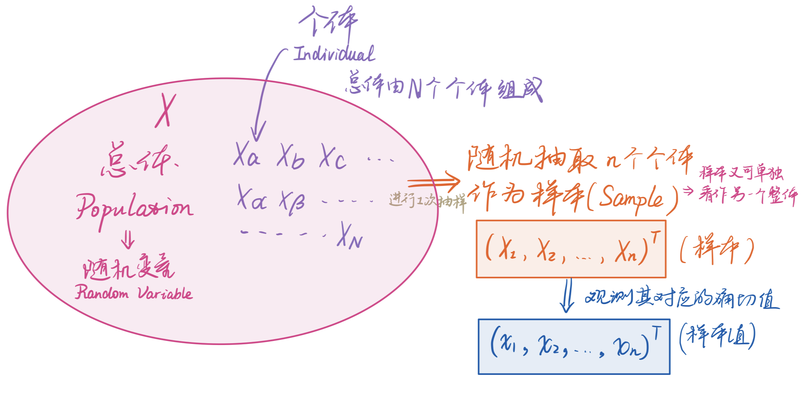

| Statistic (统计量)             | Population (总体) - $N$ 个 | Sample (样本) - $n$ 个 |
| :----------------------------- | :------------------------: | :--------------------: |
| ***Mean***                     |           $\mu$            |  $\bar{X}=\hat{\mu}$   |
| ***Variance***                 |         $\sigma^2$         |  $s^2=\hat{\sigma}^2$  |
| ***Proportion***               |           $\pi$            |          $p$           |
| ***Correlative Coefficience*** |           $\rho$           |          $r$           |
```python
import numpy as np

# Convert multiple-rows data to the MATRIX of COLUMN VECTORS
np.matrix([<data_1>, <data_2>,...]).T

> input:  data_1 = [0, 1, 2]
		  data_2 = [9, 8, 7]
    	  print(np.matrix([data_1, data_2]))  # Left
    	  print(np.matrix([data_1, data_2]).T)  # Right
> output: +---+---+---+    	 	+---+---+
		  | 0 | 1 | 2 |		  	| 0 | 9 |
          +---+---+---+    	  	+---+---+
          | 9 | 8 | 7 |         | 1 | 8 |
          +---+---+---+         +---+---+
              					| 2 | 7 |
          						+---+---+

                
# Ravel the 2-D data to 1-D data
<data>.ravel

> input:  m = np.array([[1, 2, 3],
                        [0, 1, 2]])
		  print(m.mean(axis=0))
    	  print(m.mean(axis=0).ravel())
> output: [[0.5, 1.5, 2.5]]
		  [0.5, 1.5, 2.5]
```

## 1.  Data Descriptive Analysis · 描述性统计分析

### 1.1. Descriptive Statistics · 描述性统计量

#### 1.1.1.  Measures of Location and Dispersion · 位置和分散程度的度量

There are 8 important statistics uesd to measure the location and dispersion, which are `Mean`, `Median`, `Percentile`, `Variation`, `Standard Deviataion`, `Standard Error of Mean`, `Coefficience of Variation`, and `Range`.

1. **Mean  (均值, $\mathbb{E}[X] = \bar{X} = \left\langle X \right\rangle$)**

   The average of all entries. 
   $$
   \begin{aligned}
   &\mu = \frac{1}{N} \sum_{i=1}^N{X_i} \\
   &\hat{\mu} = \bar{X} = \frac{1}{n} \sum_{i=1}^n{X_i}
   \end{aligned}\tag{1.1}\label{1.1}
   $$
   > *e.g.*
   > $$
   > \begin{aligned}
   > 	X &= \{1,2,3,4,5\}\\
   >  \bar{X} &= \frac{1+2+3+4+5}{5} = \frac{15}{5}=3
   >    \end{aligned}
   > $$

   ```python
   import scipt.stats as st
   
   # 1. Use numpy
   # 	axis = 0    -> column-wise
   #		 = 1 	-> row-wise
   #		 = none -> all entries (default)
   np.mean(<data>, axis=)
   <ndarray-like data>.mean()
   
   # 2. Use scipy.stats
   # 	Compute the mean of the closed interval
   st.tmean(<data>, <interval as (a, b)>)
   ```

2. **Median (中位数)**

   The middle number of all entries. ==Data must be sorted in **ascending **order== *(no need to sort first with Python)*.

   In `Symmetric Distribution` (like $t$-distribution and normal-distribution, 对称分布), the median is very close to the mean; while in `Skewed Distribution` (like $F$-distribution, 偏态分布), the difference between median and mean is relatively large. 
   $$
   m_e = 
   	\begin{cases}
   		x_\frac{N+1}{2} &,\text{if $N$ is odd}\\
   		\frac{1}{2} \left(x_\frac{N}{2}+x_\frac{N+1}{2}\right) &,\text{if $N$ is even}
   	\end{cases} \tag{1.2}\label{1.2}
   $$

   > *e.g.*
   > $$
   > \begin{aligned}
   > 	&X = \{1,2,3,4,5,6\}\\
   > 	&m_e = \frac{1}{2} (x_3 + x_4) = \frac{3+4}{2} = 3.5
   > \end{aligned}
   > $$
   > 

   ```python
   # reverse: False by default (desending)
   sorted(<data>, reverse=True)  # Order data by ascending
   
   np.median(<data>)
   ```

3. **Percentile (百分位数)**

   Represent specific-location data. ==Data must be sorted in **ascending **order== *(no need to sort first with Python)*. The symbol $\lceil\rceil$ means rounded up (*e.g.*, $\lceil2.1\rceil=\lceil2.9\rceil=3$).
   $$
   m_p = 
   	\begin{cases}
   		x_{\lceil{N \times perc}\rceil} &,\text{if $N \times perc \notin \mathbb{N}^+$}\\
   		\frac{1}{2} \left(x_{N \times perc} + x_{N \times perc + 1}\right) &,\text{if $N \times perc \in \mathbb{N}^+$}
   	\end{cases} \tag{1.3}\label{1.3}
   $$

   > *e.g.1*
   > $$
   > \begin{aligned}
   > 	&X = \{1,2,3,4,5\}\\
   > 	&m_{50\%} = x_{\lceil{5 \times 50\%}\rceil} = x_{\lceil{2.5}\rceil} = x_3 = 3
   > \end{aligned}
   > $$
   > *e.g.2*
   > $$
   > \begin{aligned}
   > 	&X = \{1,2,3,4,5,6\}\\
   > 	&m_{50\%} = \frac{(x_{50\% \times 6} + x_{50\% \times 6 + 1})}{2} = \frac{(x_3 + x_4)}{2} = \frac{3+4}{2} = 3.5
   > \end{aligned}
   > $$
   > 

   ```python
   np.quantile(<data>, <percentile>)
   ```

4. **Variance (Var, 方差, $\text{Var[$X$]}$)**

   Measure the dispersion of data, namely the degree of the samples dispersion from the mean. **The more concentrated the data, the smaller the variance, vice versa.**

   $$
   \begin{aligned}
   &\sigma^2 = \frac{1}{N} \sum_{i=1}^N (X_i-\mu)^2\\
   
   &\left\{
   \begin{aligned}
       &\hat{\sigma}_{biased}^2=s_{biased}^2 = \frac{1}{n} \sum_{i=1}^n \left(X_i-\bar{X}\right)^2\\
       &\hat{\sigma}_{unbiased}^2=s_{unbiased}^2 = \frac{1}{n-1} \sum_{i=1}^n \left(X_i-\bar{X}\right)^2
   \end{aligned}
   \right.
   
   \end{aligned} \tag{1.4}\label{1.4}
   $$

   > *e.g.*, The following picture can easily figure the relationship between *variance* and *dispersion* of data.
   >
   > 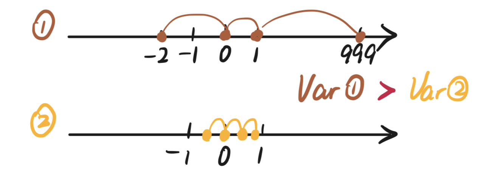

   ```python
   # Biased Estimator of variance
   np.var(<data>)
   
   # Unbiased Estimator of variance
   st.tvar(<data>)
   ```

   

   **==There are two kinds of estimation: `Unbiased Estimation` (无偏估计) and `Biased Estimation` (有偏估计).== **
       If we want to discern an unknown distribution (*i.e.*, $\mu,\sigma^2$ are all unknown), we need to take some samples to estimate its $\{\mu,\sigma^2\}$. Mean can be easily compute by $\eqref{1.1}$, but variance is a little complex for which refers the conception of the `Freedom Degree` (自由度).
       Consider an extreme case that we **take only one sample** $X=\{X_1\}$, so we can easily estimate that
   $$
   \text{the population mean estimator }\hat{\mu}=\text{the sample mean }\bar{X}=\frac{X_1}{1}
   $$
   > `Estimator`: an estimation **function** of samples (*i.e.*, $\bar{X}$).
   > `Estimate`: a **certain value** compute by substitute one sample to the estimator (*i.e.*, $\frac{1+2}{2}=1.5$).

   But when we want to estimate the population variance $\sigma ^2$ by the sample variance $s^2=\hat{\sigma}^2$ with $\hat{\mu}$, we will find something counterintuitive: 

   - if we compute $\hat{\sigma}^2$ by divide $n$ intuitively, we will get $\hat{\sigma}^2=\frac{(X_1-X_1)^2}{1}=0$ which is counterintuitively, because the only one element does not exist $\hat{\sigma}^2$, so we cannot compute $\hat{\sigma}^2$ by only one element; 
   - while if we compute $\hat{\sigma}^2$ by divide $(n-1)$ counterintuitively, we will get $\hat{\sigma}^2=\frac{(X_1-X_1)^2}{1-1}=\frac{0}{0}$ which is cannot be computed but intuitively. This means that although the numerator looks like having an item $(X_1-X_1)^2$, <font color=red>the information it contains is actually  0 (*i.e.*, ${\color{red} \text{freedom degree }df = 0}$)</font>.

   Expand this case to two samples: when we have two samples $X=\{X_1,X_2\}$, we can get $\hat{\mu}=\bar{X}=\frac{X_1+X_2}{2}$, $\hat{\sigma}^2=s^2=\frac{(X_1-\bar{X})^2+(X_2-\bar{X})^2}{2}$. However actually, we can find that $(X_1-\bar{X})=-(X_2-\bar{X})$, namely one of them **is not free**, so the information it contains is actually 1 (*i.e.*, $\text{freedom degree }df = 1$). <font color="red">**By analogy, when we have ${\color{red} n}$ samples, we get its ${\color{red} df=n-1}$**</font>, which means we only calculated $(n-1)$ deviances from the population, so that:

   - To **estimate the population variance $\sigma^2$ closest**, we **calculate the sample variance $s^2$ by divide $(n-1)$**, which named ==**unbiased estimator of the population variance $\hat{\sigma}^2$**==, where $\mathbb{E}\left(s^2\right)=\sigma^2$; 
   - And if we calculate $s^2$ by $n$, we will get ==**biased estimator of the population variance $\hat{\sigma}^2$**==, where $\mathbb{E}\left(s^2\right)\ne\sigma^2$.

5. **Standard Deviation (SD, 标准差)**

   The square root of variation.
   $$
   \begin{aligned}
   &\sigma = \sqrt{\frac{1}{N} \sum_{i=1}^N \left(X_i-\mu\right)^2}\\
   
   &\left\{
   \begin{aligned}
       &\hat{\sigma}_{biased}=s_{biased} = \sqrt{\frac{1}{n} \sum_{i=1}^n \left(X_i-\bar{X}\right)^2}\\
       &\hat{\sigma}_{unbiased}=s_{unbiased} = \sqrt{\frac{1}{n-1} \sum_{i=1}^n \left(X_i-\bar{X}\right)^2}
   \end{aligned}
   \right.
       
   \end{aligned} \tag{1.5}\label{1.5}
   $$

   ```python
   # Biased Estimator of standard deviation
   np.std(<data>)
   
   # Unbiased Estimator of standard deviation
   st.tstd(<data>)
   ```

6. **Standard Error of the Mean (SEM, 标准误)**

   Measure the dispersion of the sample mean for every sample, and the deviation of *the population mean $\mu$* and *the sample mean $\bar{X}$*. **The smaller the SEM, the smaller the deviation between $\mu$ and $\bar{X}$, vice versa**.
   $$
   \begin{aligned}
   \hat{\sigma}_{SEM} = \sqrt{\frac{1}{m-1} \sum_{j=1}^m \left(\bar{X}_j-\bar{\bar{X}}\right)} \quad\cong\quad \frac{s_{j\_unbiased}}{\sqrt{n}}
   \end{aligned} \tag{1.6}\label{1.6}
   $$
   where $i=\{1,...,n\}$ means the number of entries for every sample, $j=\{1,...,m\}$ means the number of samples. In general, we sample one time and use *this sample SD* divided by $\sqrt{n}$, as shown on the right of $\eqref{1.6}$.

   > *e.g.*, Suppose we sample three times, every sample have four entries. The data are shown in the table below.
   >
   > | &emsp;&emsp;&emsp;&emsp;sample $j$ <br>entry $i$ | A    | B    | C    |
   > | ---------- | ---- | ---- | ---- |
   > | **1**                    | 0    | 0    | 0    |
   > | **2**                    | 1    | 2    | 4    |
   > | **3**                    | 2    | 4    | 8    |
   > | **4**                    | 3    | 6    | 12   |
   > | $\bar{X}_j$              | **1.5** | **3** | **6** |
   > | $s_{j\_unbiased}$ | **1.29** | **2.58** | **5.16** |
   >
   > $$
   > \begin{aligned}
   > &\bar{\bar{X}}=\frac{1.5+3+6}{3}=3.5\\
   > &\hat{\sigma}_m = \sqrt{\frac{(1.5-3.5)^2+(3-3.5)^2+(6-3.5)^2}{2}} \approx 2.29\quad\cong\quad \frac{1.29}{\sqrt{4}}=0.645
   > \end{aligned}
   > $$

   ```python
   # Calculate the SEM by hand
   sem = st.tstd(<data>) / np.sqrt(<the number of entries for this sample>)
   ```

   

7. **Coefficience of Variation (CV, 变异系数)**

   Measure the dispersion of data by eliminate the effects of *dimension (尺度)* and *scale (量纲)*.
   $$
   CV=\frac{\sigma}{\mu} \tag{1.7}\label{1.7}
   $$

   ```python
   # Calculate the CV by hand
   cv = st.tstd(<data>) / np.mean(<data>)
   ```

8. **Range (极差, 全距)**

   The longest length of data.
   $$
   \text{Range = $\max$ - $\min$} \tag{1.8}\label{1.8}
   $$

   ```python
   # Calculate the Range by hand
   Range = np.max(<data>) - np.min(<data>)
   ```

#### 1.1.2. Measures of Relationships · 关系度量

1. **Variance-Covariance Matrix (方差-协方差矩阵) & Correlation Coefficient Matrix (相关系数矩阵)**

   `Covariance`: Measure the changing trends between the 2 or more variables. This matrix is symmetric along the diagonal.
   $$
   \left\{
      \begin{aligned}
          &\hat{\sigma}^2_{xx} = s^2_{xx} = \frac{1}{n-1} \sum_{i=1}^n{\left(X_i-\bar{X}\right)^2} = \text{Var({$X$})} \\
          &\hat{\sigma}^2_{yy} = s^2_{yy} = \frac{1}{n-1} \sum_{i=1}^n{\left(Y_i-\bar{Y}\right)^2} = \text{Var({$Y$})} \\
          &\hat{\sigma}^2_{xy} = s^2_{xy} = \frac{1}{n-1} \sum_{i=1}^n{\left(X_i-\bar{X}\right)\left(Y_i-\bar{Y}\right)} = s^2_{yx} = \hat{\sigma}^2_{yx}
      \end{aligned} 
      \right. \tag{1.9}\label{1.9}
   $$
   `Correlation Coefficient`: ==Normalize (归一化) the covariance== to measure the degree of linear correlation between 2 or more variables.
   $$
   \rho_{XY} = \frac{\text{Cov}(X, Y)}{\sigma_X \sigma_Y} \in [-1,1]\tag{1.10}\label{1.10}
   $$

   > The meaning of $\rho$ is as follows
   >
   > 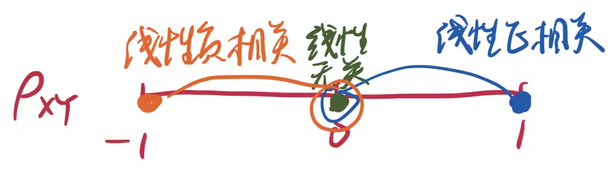
   >
   > and the visualization is as follows
   >
   > 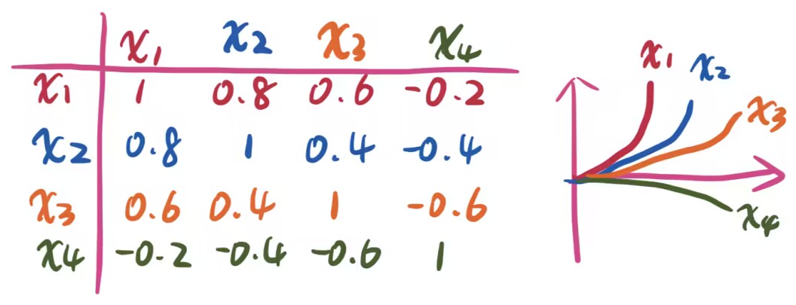
   
   ```python
   # Variance-Covariance Matrix
   np.cov(<data>)  # The data form must be a ROW VECTOR
   
   
   # Correlation Coefficient Matrix
   # 1. Use Numpy
   np.corrcoef(<data>)  # The data form must be a ROW VECTOR
   
   # 2. Use Pandas
   pd.DataFrame.corr(<data>)  # The data form must be a ROW VECTOR
   ```
   

#### 1.1.3. Measures of Distribution Shapes · 分布形状的度量

1. **Skewness (偏度)**

   Measure the degree of asymmetry in the data. ==The more the SK is to 0, the more the curve fits the normal distribution.==
   $$
   g_1 = SK(X) = \frac{n \sum\limits_{i=1}^n{\left(X_i - \bar{X}\right)^3}}{(n-1)(n-2)s^3} = \frac{n^2 \mu_3}{(n-1)(n-2)s^3}
   \tag{1.11}\label{1.11}
   $$
   where $s$ means the `Standard Deviatation`, $\mu_3$ means `The Third Order Central Moment` (三阶中心矩), $\mu_3 = \frac{1}{n} \sum\limits_{i=1}^n\left(X_i-\bar{X}\right)^3$.

   > The distribution shapes under different skewness are as follows
   >
   > 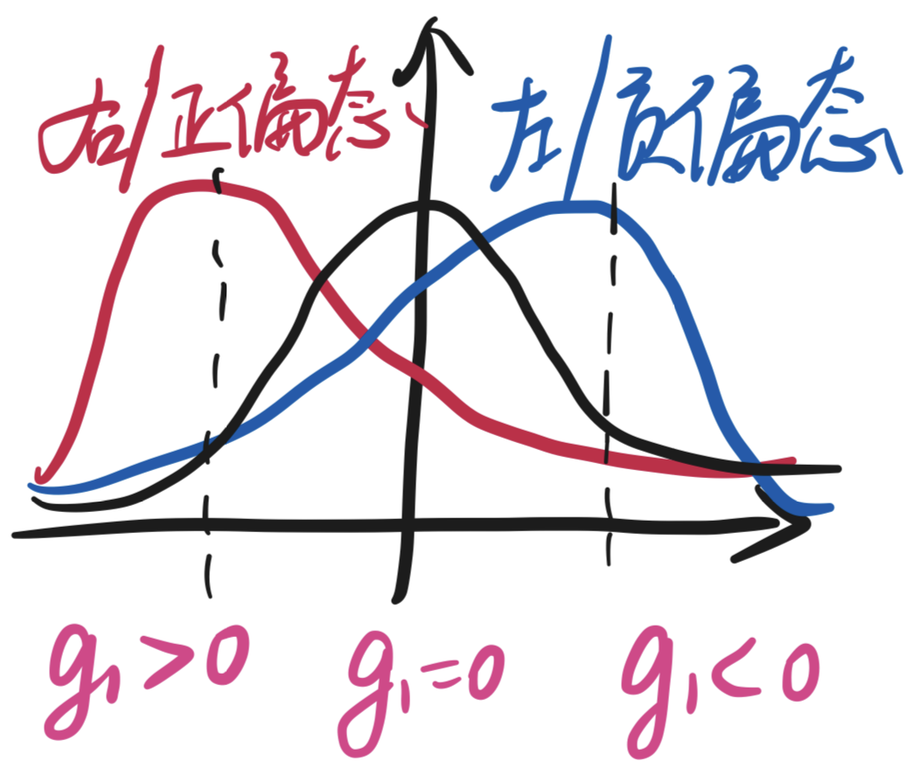

   ```python
   # 1. Use Pandas, calculate the modified skewness (Unbiased Estimation)
   data_s = pd.Series(<data>)
   data_s.skew()
   
   # 2. Use Scipy
   #	bias = False -> Modified (Unbiased)
   #		 = True  -> Unmodified (Biased) (Default)
   st.skew(<data>, bias=)
   ```

2. **Kurtosis (峰度)**

   Measure the sharpness of the `Probability Density Function` (PDF, 概率密度函数) at $\mu$.
   $$
   \begin{aligned}
   g_2 = K(X) &= \frac{n(n+1) \sum\limits_{i=1}^n{\left(X_i - \bar{X}\right)^4}}{(n-1)(n-2)(n-3)s^4} - 3\frac{(n-1)^2}{(n-2)(n-3)} \\ \\
   &= \frac{n^2 (n+1) \mu^4}{(n-1)(n-2)(n-3)s^4} - 3\frac{(n-1)^2}{(n-2)(n-3)}
   \end{aligned}\tag{1.12}\label{1.12}
   $$
   where $s$ means the `Standard Deviatation`, $\mu_3$ means `The Fourth Order Central Moment` (四阶中心矩), $\mu_4 = \frac{1}{n} \sum\limits_{i=1}^n\left(X_i-\bar{X}\right)^4$.
   > The distribution shapes under different kurtosis are as follows
   >
   > 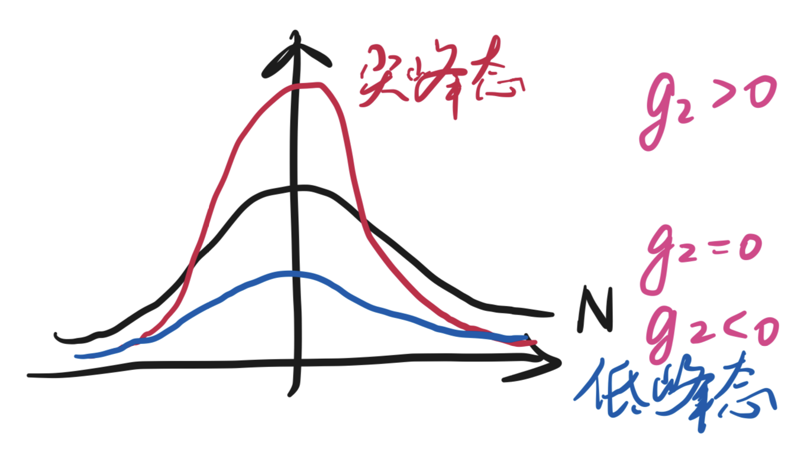

   ```python
   # 1. Use Pandas, calculate the modified kurtosis (Unbiased Estimation)
   data_s = pd.Series(<data>)
   data_s.kurt()
   
   # 2. Use Scipy
   #	bias = False -> Modified (Unbiased)
   #		 = True  -> Unmodified (Biased) (Default)
   st.kurtosis(<data>, bias=)
   ```

#### 1.1.4. Summary of Data Characteristics · 数据特性的总括

Data characteristics usually means the `Global Extremum`, `Mean`, `Unbiased Variance`, `Modified Skewness`, `Modified Kurtosis`, and `Distribution`. The *descriptive statistics* can be calculated by the above content, and the *distribution* can be tested by `Normality Test` (like `Shapiro Test`) or `Distribution Fit Test` (like `Kolmogorov-Smirnov Test`)

```python
# Check the decriptive statistics
st.describe(<data>, bias=False)

# Test the distribution
# 1. Normality Test
st.shapiro(<data>)
# 2. Distribution Fit Test
st.kstest(<data>, <name of the dist as "t">, <df of the dist as (3,)>)

# p.s. Generate an F-distribution with df=(2, 9)
st.f.rvs(size=, dfn=2, dfd=9)
```

### 1.2. Data Distribution · 数据分布

#### 1.2.1. Fundamental Concepts · 基础概念

1. **Probability Space ($(\Omega, \mathcal{F}, P)$,概率空间), **
   **Sample Space ($\Omega$, 样本空间), **
   **Random Event ($A \in \mathcal{F}$ , 随机事件), **
   **Random Variable ($X(e)$, RV, 随机变量)**

   `Sample Space`: The set $\Omega$ composed of all possible outcomes of a *random experiment $E$*. The elements of $\Omega$ (*i.e.*, each outcome of $E$) is called a *sample point $e$*.

   `Random Event`: The set composed of several possible outcomes of of a *random experiment $E$* (*i.e.*, The subset of $\Omega$ (could be $\Omega$ itself)). A single point set consisting of one sample point $e$ is called a *basic event*.

   `Random Variable`: For $\Omega = \{e\}$, $X(e)$ is a *real-valued single-valued function* defined on $\Omega$. The $X=X(e)$ is called a *random variable*, and the value of $X$ is $x$. ==The essence of a random variable is a function that maps $e$ from $\Omega$ to a real number $x$.==
   `real-valued single-valued function`: For $y(x)$, we have $y,x \in \mathbb{R}$; and for each $x$, there is a unique definite $y$ corresponding to the $x$.

   > *e.g.*, Consider a sample space $\Omega = \{e_1, e_2, e_3\}$, there is a random variable $X=X(e)$ to map every sample point to a unique real number $x$. For example,  $X(e_1) = x_1$.
   >
   > 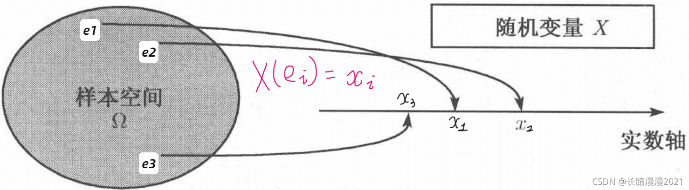

   `Probability Space`: A probability space is composed by a triad $(\Omega, \mathcal{F}, P)$, where $A \in \mathcal{F}$ is a random event, $\mathcal{F}$ is the set of all possible $A$, $P(A)$ is the probability of $A$ occurring.

2. **Population (总体), **
   **Individual (个体), **
   **Sample (样本),**
   **Parameter Space (参数空间),**
   **Distribution Family (分布族),**
   **Statistics (统计量)**

   `Population`: The set of all elements of the research object. Each population can be represented by a random variable $X$.

   `Individual`: Every entry which makes up the population.

   > *e.g.*, Inspecting the quality of a batch of light bulbs, we choose **life** and **brightness** as the index.
   >
   > 1. The random variable $X=\{X_a, X_b, ...\}$ represents the life of all the bulbs is the *population*, and $X_a$ represents the life of one specific the bulb is a *individual*, its corresponding value of life is $x_a$.
   > 2. The random variable $Y=\{Y_a, Y_b, ...\}$ represents the brightness of all the bulbs is the *population*, and $Y_a$ represents the brightness of one specific the bulb is a *individual*, its corresponding value of brightness is $y_a$.

   `Sample`: Randomly select $n$ individuals $X_1,X_2,...,X_n$ from the population $X$, recorded as $\left(X_1,X_2,\cdots,X_n\right)^T$. Its corresponding *sample value* is $\left(x_1,x_2,\cdots,x_n\right)^T$. ==A sample or one of its features can be regarded as a new random variable.==
   `Simple Random Sample`: The samples that satisfied the 2 properties: *independent* and *identically distributed*.

   `Parameter Space`: All possible values of the parameters of a distribution or function.

   `Distribution Family`: Different combinations of parameter space.

   > *e.g.*, Let one normal distribution has 2 parameters: $N(\mu,\sigma^2)$.
   >
   > **Parameter Combination**: $(\mu,\sigma^2)$
   >
   > **Parameter Space**: $\mu = \{0, 1, 2\}$
   >
   > ​							 	  $\sigma^2=\{4, 9\}$
   >
   > **Distribution Family**: $(0,4),(1,4),(2,4),(0,9),(1,9),(2,9)$

   `Statistics`: An n-ary function $g(X_1,X_2,\cdots,X_n)$ about a simple random sample $\left(X_1,X_2,\cdots,X_n\right)^T$ of population $X$ without any unknown parameters (*e.g.*, `Mean`).

   > Generally, the parameter of population is unknown and difficult to get directly. To explore the parameter of population, we usually make samples and calculate their statistics to estimate it.

3. **Discrete Random Variable (离散型随机变量)**

   The values that RV. $X$ can take is *finite* or *infinitely many* (有限个或可列无穷多个). 
   $$
   P\{X=x_k\}=p_k, \quad k=1,2,\cdots\tag{1.13}\label{1.13}
   $$
   All of the $p_k$ consist the `Probility Mass Function` (PMF, 概率质量函数) of RV. $X$.
   > The value of each point of PMF is meaningful, $\text{PMF}(X=x_k)=p_k$
   >
   > 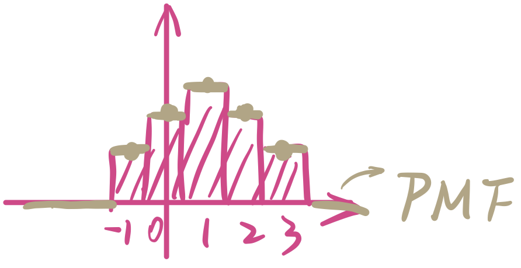

4. **Continuous Random Variable (连续型随机变量)**

   For non-negtive function $f(x),x\in\mathbb{R}$, if
   $$
   F_X(x) = P\{X \leqslant x\} = \int_{-\infty}^{x} f(t)\, {\rm d}t
   \tag{1.14}\label{1.14}
   $$

   then $X$ is continuous random variable, $f(x)$ is the `Probability Density Function` (PDF, 概率密度函数) of RV. $X$.

   > The value of each point of PDF is meaningless, $\text{PDF}(X=x_k)=0$
   >
   > 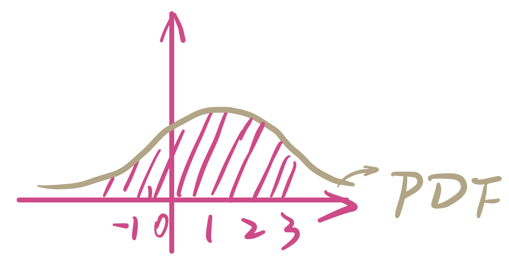

5. **Probability Distribution Function (Culmulative Distribution Function, CDF, 累积分布函数)**
   $$
   F_X(x) = P\{X \leqslant x\},x\in\mathbb{R}\tag{1.15}\label{1.15}
   $$
   

   > The derivative of CDF is PDF, the integral of PDF is CDF.
   > $$
   > \frac{dF(x)}{dx}=f(x) \iff \int_{-\infty}^{+\infty} f(x)\, {\rm d}x = F(x)
   > $$
   > 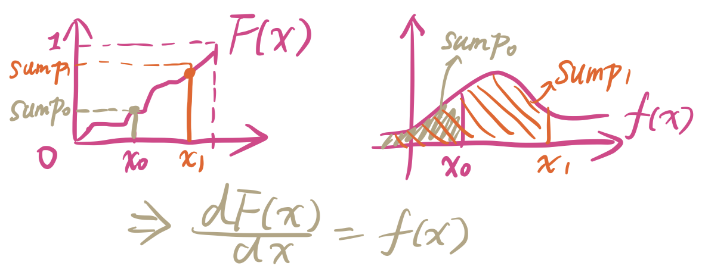
   
6. **Mathematic Expectation ($\mathbb{E}(·)$, 数学期望)**

   $\mathbb{E}(·)$ can be considered as a kind of `Weighted Average`.

   Let the <font color="orange">PMF</font> / <font color="blueviolet">PDF</font> of <font color="orange">discrete</font> / <font color="blueviolet">continuous</font> RV. $X$ be ${\color{orange}  P(X=x_i)=p_i, \ i=1,2,\cdots}$ / ${\color{blueviolet} f(x)}$; if
   <font color="orange">the series</font>  ${\color{orange} \sum_{i} \left\vert x_i \right\vert p_i}$ / <font color="blueviolet">the integral</font> ${\color{blueviolet} \int_{-\infin}^{+\infin} \left\vert x \right\vert f(x)\, {\rm d} x}$ is convergence, then its mathematic expectation
   $$
   \begin{aligned}
   &{\color{orange} \mathbb{E}(X)=\sum_{i} x_ip_i}\\
   &{\color{blueviolet} \mathbb{E}(X)=\int_{-\infin}^{+\infin} xf(x)\, {\rm d} x}
   \end{aligned}
   \tag{1.16}\label{1.16}
   $$

7. **Moment (矩，可理解为一种距离)**

   Let RV. $X \sim F(x)$, for $\forall k \in \mathbb{Z}^+$, if $\mathbb{E}(\left\vert X \right\vert)$ exists, then `The kth Order Origin Moment` of $X$ is
   $$
   \alpha_k = \mathbb{E}(X^k) = \int_{-\infin}^{+\infin} x^k\, {\rm d}F(x)
   \tag{1.17}\label{1.17}
   $$
   `The kth Order Central Moment` of $X$ is
   $$
   \mu_k = \mathbb{E}\left[\left(X-\mathbb{E}(X)\right)^k\right] = \int_{-\infin}^{+\infin} \left[X-\mathbb{E}(X)\right]^k\, {\rm d}F(x)
   \tag{1.18}\label{1.18}
   $$
   |     矩类型     | 含义                                       |
   | :------------: | ------------------------------------------ |
   | **零阶原点矩** | 所有数据总和                               |
   | **一阶原点矩** | 期望 Expectation $\mathbb{E}(·)$           |
   | **二阶中心矩** | 方差 Variance $\sigma^2$                   |
   | **三阶中心矩** | 用于计算偏度 Skewness $\text{SK}(·) = g_1$ |
   | **四阶中心矩** | 用于计算峰度 Kurtosis $\text{K}(·) = g_2$  |

#### 1.2.2. Discrete Probability Distribution · 离散型概率分布

1. **Binomial Distribution (二项分布)**

   Comes from *Bernoulli Experiment*. **The binomial distribution $B(n,p)$ means that in an *$n$-fold Bernoulli Experiment (n 重伯努利试验)*, $p$ is the probability of the event $A$ happens exactly $k$ times.**
   `n-fold Bernoulli Experiment`: The *$n$ independent repeated expriment ($n$ 次独立重复实验)* which means **repeat the Bernoulli Experiment $n$ times** in the same condition, and the result of each experiment is not influenced by others.
   
   The `Distribution Law` and `CDF ` of Binomial Distribution is as follow:
   $$
   \begin{aligned}
   &\left\{
   	\begin{aligned}
   	& P\{X = k\} = C_n^k p^k (1-p)^{n-k}, \quad k=1,2,\cdots,n \\
   	& F(x) = \sum_{k=0}^{\lfloor x \rfloor} C_n^k p^k (1-p)^{n-k} = P\{X \leqslant x\}
   	\end{aligned}
   \right.\\\\
   &\Rightarrow X \sim B(n,p)
   \end{aligned}
   \tag{1.19}\label{1.19}
   $$
   where:
   
   | Symbol  | Meaning                                                      |
   | :-----: | :----------------------------------------------------------- |
   |   $n$   | The total experiment times                                   |
   |   $k$   | The number of times event $A$ occurs exactly                 |
   |  $n-k$  | The number of times event $A$ does not occur                 |
   | $C_n^k$ | The number of combinations event $A$ occurs exactly $k$ times in $n$ experiments |
   |   $p$   | The probability event $A$ occurs exactly                     |
   |  $1-p$  | The probability event $A$ does not occur                     |
   
   > *e.g.*, There are 90 independent same devices, their failure rate = 0.01, and one person can only cope the failure of one device. There are 2 ways to distribute the maintenance workers:
   > 		(1) Each worker responsible for 30 devices, the 3 workers maintain separately;
   > 		(2) All 3 workers responsible for 90 devices jointly. 
   > 	Find the probability that workers cannot repair the failure devices in time in these 2 ways separately.
   >
   > 
   >
   > **Solution.** 
   >
   > There are 2 situations of the devices: *Normal* or *Failure*, so it can be solved by Binomial Distribution. *Probability of simultaneous failure of more than $x_0$ devices is $P\{X > x_0\}$.*
   >
   > ​	For way (1), “can repair devices in time” means *there cannot be more than 2 devices getting failure at the same time in 30 devices*. Because these 30 devices are only responsible by one person who can only handle one failure device at the same time.
   > ​	For way (2), “can repair devices in time” means *there cannot be more than 4 devices getting failure at the same time in 90 devices*. Because these 90 devices are responsible by 3 person who can handle 3 failure device at the same time.
   >
   > To sum up, in way (1), $x_0 = 1,\ P=\{X>1\}$; in way (2), $x_0 = 3,\ P=\{X>3\}$. This can be solved by python as follow. **Thus we can conclude that when all 3 workers responsible for 90 devices jointly, the probability that workers cannot repair the failure devices in time is less. **
   
   ```python
   # 生存函数 (Survival Function)
   # SF:  P{X > x_0}
   # CDF: P{X <= x_0}
   # CDF + SF = 1
   
   # k: x_0; p: occuring rate; n: all samples
   st.binom.sf(k=1, p=0.01, n=30) * 3  # 0.10844 = 0.03615 * 3
   st.bionm.sf(k=3, p=0.01, n=90)		# 0.01294
   
   1 - st.binom.cdf(k=1, p=0.01, n=30) * 3
   1 - st.binom.cdf(k=3, p=0.01, n=90)
   ```
   
   
   ==**Arrangement (Permutation) and Combination (排列组合)**==
   
   `Arrangement`: The number of sampling methods about sample $m$ times **in sequence** from $n$ things. (从 $n$ 开始乘 $m$ 个数)
   $$
   A_n^m = \frac{n!}{(n-m)!} = \overbrace{n\times(n-1)\times\cdots}^{m}, \quad m \leqslant n
   \tag{1.20}\label{1.20}
   $$
   `Combination`: The number of sampling methods about sample $m$ times **out of sequence** from $n$ things. (从 $n$ 开始乘 $m$ 个数，再除以 $m$)
   $$
   C_n^m = \frac{n!}{m! \times (n-m)!} = \frac{\overbrace{n\times(n-1)\times\cdots}^{m}}{m}, \quad m \leqslant n
   \tag{1.21}\label{1.21}
   $$
   
   > *e.g.*, Consider there are $n=3$ things need to be sampled $m=2$ times, so that
   > $$
   > \begin{aligned}
   > & A_3^2 = \frac{3!}{(3-2)!} = \frac{3\times2\times1}{1} = \overbrace{3\times2}^{m=2} = 6 \\
   > & C_3^2 = \frac{3!}{2! \times (3-2)!} = \frac{3\times2\times1}{(2\times1)\times1} = \frac{\overbrace{3\times2}^{m=2} }{2} = 3
   > \end{aligned}
   > $$
   > 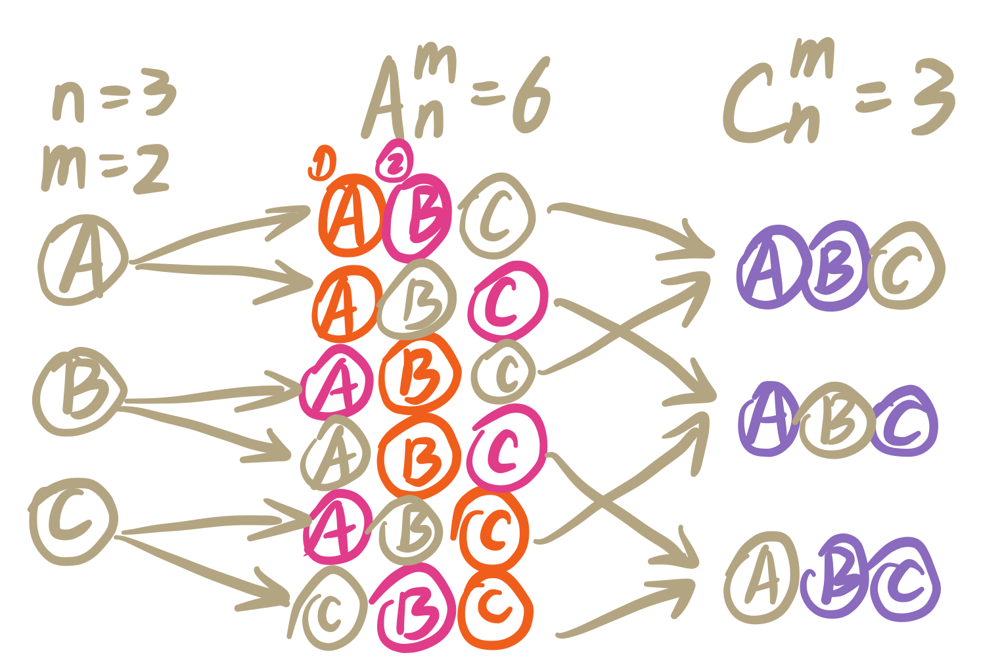

2. **Poisson Distribution (泊松分布)**

   $\pi(\lambda)$ means the poisson distribution which parameter is $\lambda > 0$. The poisson regression is usually used in `Generalized Linear Model` and `Logarithm Linear Model`.
   
   The distribution law and CDF of Possion Distribution is as follow:
   $$
   \begin{aligned}
   &\left\{
   	\begin{aligned}
   	& P\{X = k\} = \frac{\lambda^ke^{-\lambda}}{k!}, \quad k=1,2,\cdots \\
   	& F(x) = \sum_{k=0}^{\lfloor x \rfloor} \frac{\lambda^ke^{-\lambda}}{k!} = P\{X \leqslant x\}
   	\end{aligned}
   \right.\\\\
   &\Rightarrow X \sim \pi(\lambda)
   \end{aligned}
   \tag{1.22}\label{1.22}
   $$
   where $\mu(X) = \sigma^2(X) = \lambda$.
   
   > *e.g.*, Let the probability of a scar on a 1-foot wire be $\frac{1}{1000}$, and consider the reality, let the probability of 2 or more scars on a 1-foot wire be 0.
   >     Find the probability of 5 or more scars on 3000-foot wire.
   >
   > 
   >
   > **Solution.**
   >
   > 

#### 1.2.3. Continuous Probability Distribution · 连续型概率分布

1. **Normal Distribution (正态分布)**

   asd

2. **t-distribution (Student’s t distribution, t 分布)**

   asd

3. **Gamma Distribution (伽马分布)**

   asd

4. **Chi-Square Distribution (卡方分布)**

   asd

5. **F-distribution (F 分布)**

   asd

### 1.3. Histogram, Experience Distribution and QQ Graph · 直方图，经验分布函数与 QQ 图

#### 1.3.1. Histogram and Kernel Density Estimation · 直方图与核密度估计


#### 1.3.2. Experience Distribution · 经验分布函数


#### 1.3.3. QQ Graph and Stem-and-Leaf Display · QQ 图与茎叶图


### 1.4. Multivariate Data · 多元数据

#### 1.4.1. Numerical Features of Multivariate Data · 多元数据的数字特征

asd

#### 1.4.2. Graphical Representation of Multivariate Data · 多元数据的图形表示

asd
